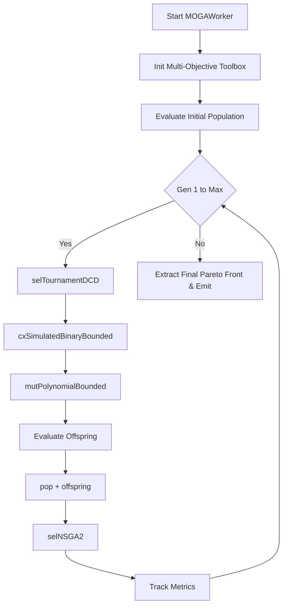

# MOGA (Multi-Objective Genetic Algorithm) Documentation

## Overview
The MOGA worker in DeVana is a specialized implementation designed for multi-objective optimization, utilizing the core mechanisms of NSGA-II to evaluate trade-offs between performance, complexity, and cost in DVA parameter design.

While it shares structural similarities with `NSGA2Worker`, it represents a distinct configuration focusing on maintaining multi-objective pareto fronts with standard simulated binary bounded crossover and polynomial bounded mutation.

## Class: `MOGAWorker` (inherits `QThread`)

### Purpose
Executes a multi-objective genetic algorithm in a background thread. It minimizes three objectives (Performance, Sparsity, Cost) and uses `tools.selNSGA2` for environmental selection.

### Key Initialization Parameters
*   `main_params`: Primary structural parameters.
*   `dva_params`: List of DVA variables including bounds, fix-flags, and cost coefficients.
*   `target_values_weights`: The mass-specific target goals for the FRF engine.
*   `pop_size`, `generations`: Basic GA setup.
*   **Operators:** `cxpb`, `mutpb`, `eta_c`, `eta_m`, `indpb`.
*   **Sparsity Constraints:** `sparsity_tau`, `sparsity_alpha`, `sparsity_beta`.
*   **Execution & Acceleration:** `num_runs`, `random_seed`, `use_pinn_solver`, `pinn_online_learning`.

### Methods

#### 1. `evaluate(self, individual)`
**Purpose:** Calculates the tri-objective fitness.
**Logic:**
- $f_1$ (Performance): FRF singular response, or scalar prediction from the PINN surrogate (with occasional online learning triggers).
- $f_2$ (Sparsity): $L_0$-like activation count penalized by `alpha` + $L_1$ norm penalized by `beta`.
- $f_3$ (Cost): Dot product of the parameter vector and `cost_coeffs`.
**Output:** Tuple `(f1, f2, f3)`.

#### 2. `run(self)`
**Purpose:** Core execution loop.
**Logic Flow:**
1.  **Setup:** Uses `@safe_deap_operation` to clear and register `FitnessMulti` and `Individual`. Sets up standard generators bounded by `low_bounds` and `high_bounds`.
2.  **Operators:** 
    - `cxSimulatedBinaryBounded` for crossover.
    - `mutPolynomialBounded` for mutation.
    - `selNSGA2` for selection.
3.  **Iteration:** For each run (`num_runs`) and generation (`generations`):
    - Select parents via `selTournamentDCD`.
    - Apply crossover and mutation to offspring.
    - Evaluate invalid offspring.
    - Select next generation: `pop = toolbox.select(pop + offspring, self.pop_size)`.
    - Gather basic metrics (`min_f1`, `avg_f1`, memory).
4.  **Finalization:** Extracts final pareto front via `selNSGA2` and appends to `all_runs_data`. Emits `finished(all_runs_data)`.

---

## Architectural Flowchart



#### Pseudo-code
```text
BEGIN
  EXECUTE Start MOGAWorker
  EXECUTE Init Multi-Objective Toolbox
  EXECUTE Evaluate Initial Population
  EXECUTE Gen 1 to Max
  EXECUTE selTournamentDCD
  EXECUTE cxSimulatedBinaryBounded
  EXECUTE mutPolynomialBounded
  EXECUTE Evaluate Offspring
  EXECUTE pop + offspring
  EXECUTE selNSGA2
  EXECUTE Track Metrics
  EXECUTE Extract Final Pareto Front & Emit
END
```
