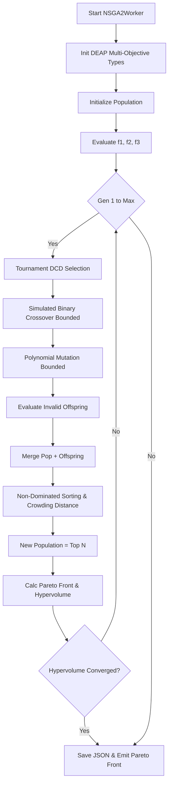

# NSGA-II (Non-dominated Sorting Genetic Algorithm II) Documentation

## Overview
The NSGA-II implementation in DeVana is designed for **multi-objective** optimization of Dynamic Vibration Absorbers (DVAs). Unlike the standard GA which scalarizes multiple goals into a single fitness value via a weighted sum, NSGA-II maintains a Pareto front, allowing the user to examine the tradeoff curve between distinct objectives.

In DeVana, NSGA-II minimizes three distinct objectives:
1.  **FRF Singular Response ($f_1$):** Peak vibration reduction across the masses.
2.  **Sparsity & Complexity ($f_2$):** A penalty for the number of active DVA parameters (using an $L_0$-like threshold and $L_1$ norm).
3.  **Cost ($f_3$):** Direct manufacturing/material cost based on user-defined coefficients.

## Class: `NSGA2Worker` (inherits `QThread`)

### Purpose
Executes the NSGA-II optimization in a background thread. It uses DEAP to handle the multi-objective selection, Simulated Binary Crossover (SBX), and Polynomial Mutation operators. It tracks Hypervolume (HV) and Pareto front size to determine convergence.

### Key Initialization Parameters
*   `main_params`: Core configuration of the primary system.
*   `dva_params`: List of parameters including bounds, fixed flags, and cost coefficients.
*   `target_values_weights`: Objectives and weighting for each mass during FRF evaluation.
*   `omega_start`, `omega_end`, `omega_points`: Frequency ranges.
*   `pop_size`, `generations`: Standard GA parameters.
*   **Genetic Operators:**
    *   `cxpb`, `mutpb`: Probabilities for crossover and mutation.
    *   `eta_c`: Crowding degree for Simulated Binary Crossover.
    *   `eta_m`: Crowding degree for Polynomial Mutation.
    *   `indpb`: Independent probability for mutating each attribute.
*   **Sparsity Objectives:** `sparsity_tau` (activation threshold), `sparsity_alpha`, `sparsity_beta`.
*   **Convergence Controls:** `convergence_epsilon`, `convergence_window`, `convergence_min_gen`.
*   **Performance Metrics:** `hv_ref_point` for hypervolume calculation.
*   **Acceleration:** `use_pinn_solver`, `pinn_model_path`, `pinn_online_learning`.

### Methods

#### 1. `evaluate(self, individual)`
**Purpose:** Calculates the three multi-objective fitness values.
**Parameters:** `individual` (A candidate solution's parameter vector).
**Logic:**
1.  **$f_1$ (Performance):** Runs standard `frf` analysis or queries the `PINNSolver` for accelerated scalar response. Includes a 5% random chance of evaluating the true FRF for online PINN refinement.
2.  **$f_2$ (Sparsity):** Counts parameters above `sparsity_tau` and multiplies by `sparsity_alpha`, plus an $L_1$ norm weighted by `sparsity_beta`.
3.  **$f_3$ (Cost):** Computes the dot product of the individual and `cost_coeffs`.
**Outputs:** Tuple `(f1, f2, f3)`.

#### 2. `run(self)`
**Purpose:** Main execution loop for NSGA-II.
**Logic Flow:**
1.  **Initialization:** Uses `@safe_deap_operation` to register `FitnessMulti` (minimizing 3 objectives) and the `Individual` class. 
2.  **Operators:** 
    - `tools.cxSimulatedBinaryBounded` (SBX) is used for crossover.
    - `tools.mutPolynomialBounded` is used for mutation.
    - `tools.selNSGA2` is used for environmental selection.
3.  **Evolution Loop:**
    - Generates offspring using `tools.selTournamentDCD` (Tournament selection based on dominance and crowding distance).
    - Applies SBX and Polynomial Mutation.
    - Evaluates invalid offspring.
    - Selects the next generation using `tools.selNSGA2(pop + offspring, pop_size)`.
4.  **Metrics:** Extracts the first Pareto front (`sortNondominated`). Computes the Hypervolume (HV) relative to `hv_ref_point`. Checks for convergence if the HV difference over `convergence_window` generations is less than `convergence_epsilon`.
5.  **Output:** Saves each run's data to a JSON file in `nsga2_results/` and emits `finished`.

---

## Architectural Flowchart



### Flowchart Pseudo-code
```text
function run_nsga2():
    register_fitness_multi(weights=(-1, -1, -1))
    pop = generate_initial_population()
    fitnesses = map(evaluate_multi, pop)
    
    for gen in 1..generations:
        offspring = select_tournament_dcd(pop, pop_size)
        apply_sbx_crossover(offspring, cxpb, eta_c)
        apply_polynomial_mutation(offspring, mutpb, eta_m)
        
        evaluate_multi(invalid_offspring)
        
        merged_pop = pop + offspring
        pop = select_nsga2(merged_pop, pop_size)
        
        pareto_front = get_front(pop, 1)
        hv = calculate_hypervolume(pareto_front)
        
        if gen > min_gen and (max(hv_window) - min(hv_window) < epsilon):
            break
            
    return final_pareto_front
```
