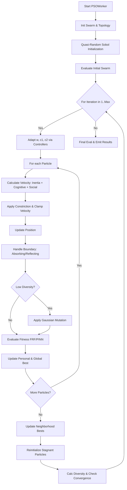

# PSO (Particle Swarm Optimization) Documentation

## Overview
Particle Swarm Optimization (PSO) is a population-based stochastic optimization technique inspired by social behavior (bird flocking). Particles (candidate solutions) move through the search space guided by their own best-known position (cognitive component) and the swarm's best-known position (social component).

DeVana's implementation is highly advanced, incorporating quasi-random initialization, multiple boundary handling strategies, adaptive inertia weights, adaptive acceleration coefficients, and topological neighborhoods.

## Class: `PSOWorker` (inherits `QThread`)

### Purpose
Executes the PSO algorithm asynchronously. Integrates with the FRF module for evaluation and incorporates PINN acceleration and ML/RL adaptive controllers (analogous to the GA implementation).

### Key Initialization Parameters
*   `pso_swarm_size`: Number of particles.
*   `pso_num_iterations`: Maximum iterations.
*   `pso_w`, `pso_w_damping`, `pso_w_min`, `pso_w_max`: Inertia weight constraints and damping.
*   `pso_c1`, `pso_c2`: Cognitive and Social acceleration coefficients.
*   `topology`: Type of neighborhood structure (`GLOBAL`, `RING`, `VON_NEUMANN`, `RANDOM`).
*   `max_velocity_factor`: Clamps velocity to prevent explosion.
*   `boundary_handling`: Strategy for boundary violations (`absorbing`, `reflecting`, `invisible`).
*   `early_stopping`, `stagnation_limit`: Control early termination and particle stagnation.
*   `quasi_random_init`: Uses Sobol sequences for initialization.

### Methods

#### 1. `adaptive_inertia_weight(self, iter_num, max_iter, best_fitness, avg_fitness, diversity)`
**Purpose:** Adaptively adjusts the inertia weight $w$ to balance exploration and exploitation.
**Logic:** Combines four strategies:
1. Linear time-varying (decreases linearly).
2. Nonlinear time-varying (decreases faster initially).
3. Fitness-based (increases when swarm is converging).
4. Diversity-based (increases when diversity drops below threshold).

#### 2. `adaptive_acceleration_coefficients(self, iter_num, max_iter, diversity)`
**Purpose:** Adjusts $c_1$ (cognitive) and $c_2$ (social).
**Logic:** $c_1$ decreases and $c_2$ increases over time. If diversity is low, it temporarily boosts $c_1$ and lowers $c_2$ to encourage exploration. Ensures $c_1 + c_2 \le 4$ for stability.

#### 3. `handle_boundary_violation(self, position, velocity, dim, low, high)`
**Purpose:** Corrects particles that move outside bounds.
**Strategies:**
- `absorbing`: Position pinned to bound, velocity set to 0.
- `reflecting`: Position bounces back, velocity inverted and damped by 0.8.
- `invisible`: Allowed outside, but penalized heavily in the fitness function.

#### 4. `evaluate_particle(self, position, parameter_bounds)`
**Purpose:** Computes fitness via FRF or PINN. Applies severe quadratic penalties if `boundary_handling` is `invisible` and limits are violated.

#### 5. `run(self)`
**Purpose:** Main execution loop.
**Logic Flow:**
1.  **Initialization:** Initializes positions via `quasi_random_initialize` (Sobol) or uniform random. Initializes velocities and evaluates initial fitness.
2.  **Neighborhood Setup:** Establishes neighbor links based on `TopologyType`.
3.  **Iteration Loop:**
    - Updates $w, c_1, c_2$ via adaptive equations, ML Bandit, or RL controller.
    - Iterates through all particles:
        - Calculates cognitive and social velocity components.
        - Applies constriction factor (Clerc & Kennedy) if $c_1 + c_2 > 4$.
        - Clamps velocity to `max_velocities`.
        - Updates position and handles boundaries.
        - Applies Gaussian mutation if diversity is below threshold.
        - Evaluates fitness.
        - Updates personal best, and checks for global best improvement.
    - Updates neighborhood bests.
    - Checks for stagnant particles (`stagnation_counter >= limit`) and reinitializes them randomly around the global best.
    - Evaluates convergence and early stopping criteria.
4.  **Finalization:** Emits best particle and performs final exact FRF.

---

## Architectural Flowchart



### Flowchart Pseudo-code
```text
function run_pso():
    positions = quasi_random_initialize()
    swarm = initialize_particles(positions)
    neighborhoods = create_neighborhoods(topology)
    
    for iteration in 1..max_iterations:
        w, c1, c2 = update_adaptive_params(iteration, diversity)
        
        for particle in swarm:
            social_best = get_social_best(particle, neighborhoods)
            
            # Velocity Update
            v_cognitive = c1 * rand() * (particle.best_pos - particle.pos)
            v_social = c2 * rand() * (social_best - particle.pos)
            particle.vel = w * particle.vel + v_cognitive + v_social
            particle.vel = apply_constriction_and_clamp(particle.vel)
            
            # Position Update
            particle.pos += particle.vel
            particle.pos, particle.vel = handle_boundaries(particle)
            
            if diversity < threshold:
                particle.pos = apply_mutation(particle.pos)
                
            fitness = evaluate_particle(particle.pos)
            update_bests(particle, fitness)
            
        update_neighborhood_bests(swarm)
        reinitialize_stagnant_particles(swarm)
        
        if check_convergence(): break
        
    return global_best_particle
```
