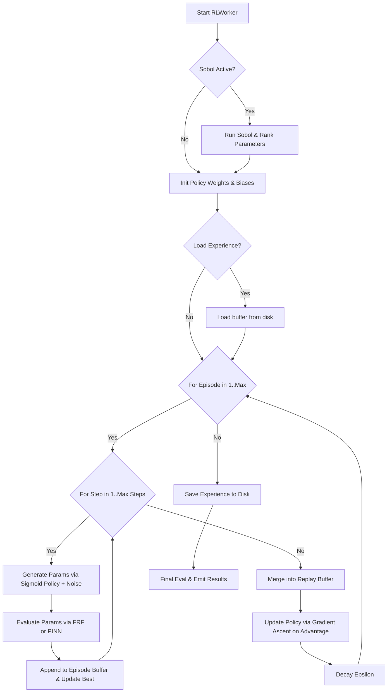

# Reinforcement Learning (RL) Optimization Documentation

## Overview
The Reinforcement Learning (RL) worker in DeVana utilizes a Deep Deterministic Policy Gradient (DDPG)-inspired approach adapted for optimizing continuous parameters of Dynamic Vibration Absorbers (DVAs). Unlike traditional tabular Q-learning which operates on discrete action spaces, this continuous policy gradient approach generates precise float values directly from a policy network, making it highly suitable for the continuous domain of mass, stiffness, and damping coefficients.

## Class: `RLWorker` (inherits `QThread`)

### Purpose
Executes policy-based continuous optimization in a background thread. It trains an RL agent (policy network) using experience replay and exploration noise, aiming to maximize a reward function that correlates directly with minimizing the DVA performance fitness.

### Key Initialization Parameters
*   `rl_num_episodes`, `rl_max_steps`: Total episodes and steps per episode.
*   `rl_alpha`, `rl_gamma`: Learning rate for policy gradient and discount factor.
*   `rl_epsilon`, `rl_epsilon_min`, `rl_epsilon_decay_type`, `rl_epsilon_decay`: Exploration rate controls (exponential, linear, inverse, step, cosine).
*   `rl_parameter_data`: DVA variables including bounds and fixed status.
*   `alpha_sparsity`: Penalty multiplier to enforce $L_1$ sparsity.
*   **Buffer & Noise:** `replay_buffer_size`, `batch_size`, `tau`, `noise_std`.
*   **Acceleration:** `use_pinn_solver`, `pinn_online_learning`.
*   **Experience Management:** `experience_save_path`, `load_existing_experience`.
*   **Sobol Initialization:** Supports running Sobol sensitivity analysis prior to training to rank parameters and order the policy network mapping.

### Methods

#### 1. `generate_parameters(self, add_noise=True)`
**Purpose:** Samples an action (parameter vector) from the current policy.
**Logic:**
- Generates `raw_params = self.policy_weights + self.policy_bias`.
- Injects Gaussian exploration noise based on `noise_std` and `rl_epsilon`.
- Normalizes via Sigmoid activation ($1 / (1 + \exp(-x))$) and scales to the actual bounds.

#### 2. `evaluate_parameters(self, params)`
**Purpose:** Computes fitness via exact FRF or PINN approximation.
**Logic:** Returns `fitness = primary_objective + sparsity_penalty`.

#### 3. `update_policy(self, experiences)`
**Purpose:** DDPG-style policy gradient update using batch experience replay.
**Logic:**
- Samples a batch of transitions from the replay buffer.
- Computes policy gradients using the advantage function `advantage = -fitness`.
- Gradients for weights and biases are accumulated.
- Updates policy weights and applies weight decay (`* 0.999`) for regularization.

#### 4. `run(self)`
**Purpose:** Main training loop for the RL agent.
**Logic Flow:**
1.  **Sobol Pre-training (Optional):** Uses `sobol_sensitivity` to rank DVA parameters by Total Effect Index ($S_T$) and reorders the parameter vectors to prioritize the most influential variables in the policy array.
2.  **Episode Loop:** For each episode up to `rl_num_episodes`:
    - **Step Loop:** For each step up to `rl_max_steps`:
        - `params = generate_parameters(add_noise=True)`
        - `fitness, results = evaluate_parameters(params)`
        - Add experience `(params, fitness, results)` to the episode buffer.
        - Track `best_fitness` and `best_solution`.
    - Push episode experiences into the master `experience_buffer` (truncated by `replay_buffer_size`).
    - `update_policy(experience_buffer)`
    - `update_epsilon(episode)`
3.  **Finalization:** Emits `best_solution`, `best_fitness`, and saves the experience buffer to disk.

---

## Architectural Flowchart



#### Pseudo-code
```text
BEGIN
  EXECUTE Start RLWorker
  EXECUTE Sobol Active?
  EXECUTE Run Sobol & Rank Parameters
  EXECUTE Init Policy Weights & Biases
  EXECUTE Load Experience?
  EXECUTE Load buffer from disk
  EXECUTE For Episode in 1..Max
  EXECUTE For Step in 1..Max Steps
  EXECUTE Generate Params via Sigmoid Policy + Noise
  EXECUTE Evaluate Params via FRF or PINN
  EXECUTE Append to Episode Buffer & Update Best
  EXECUTE Merge into Replay Buffer
  EXECUTE Update Policy via Gradient Ascent on Advantage
  EXECUTE Decay Epsilon
  EXECUTE Save Experience to Disk
  EXECUTE Final Eval & Emit Results
END
```
