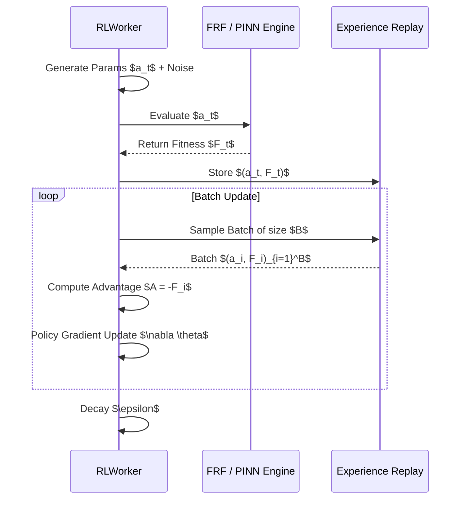

# Reinforcement Learning (RL) Optimization Deep Dive

The Reinforcement Learning optimization solver (`RLWorker.py`) introduces a purely continuous policy gradient approach, taking inspiration from Deep Deterministic Policy Gradient (DDPG) concepts. It entirely replaces traditional tabular Q-learning which struggles with continuous DVA parameter dimensions.

## 1. Scientific Background & Approach

DVA parameters (e.g., masses, stiffness coefficients) are mathematically continuous variables. The `RLWorker` frames the parameter generation process as an agent taking an action $a \in \mathbb{R}^N$ in an environment with a single state (since optimization is stateless across evaluations).

The goal of the agent is to learn a policy $\pi_\theta(s) \approx a_{optimal}$ that maximizes the reward (defined as negative fitness).

### 1.1 Policy Representation
The parameters are drawn from a simple linear policy layer wrapped in a sigmoid activation to map outputs securely into the parameter bounds $[low_i, high_i]$:

$$
raw_i = W_i + b_i
$$
$$
a_i = low_i + \left(\frac{1}{1 + e^{-raw_i}}\right) (high_i - low_i)
$$

### 1.2 Exploration
During the generation step, exploration is injected via Gaussian noise parameterized by an exponentially decaying $\epsilon$:

$$
a_{exploratory} = a + \mathcal{N}(0, \sigma \cdot \epsilon)
$$

## 2. Training Loop & Experience Replay

The algorithm utilizes **Experience Replay** to stabilize gradient updates and decouple the temporal correlation of evaluations.

### 2.1 Gradient Update
The simplified continuous policy gradient is calculated by weighting the parameter vector by the Advantage ($A = -F$):

$$
\Delta W_i = \frac{\alpha}{|B|} \sum_{batch} (-F) \cdot a_i
$$
$$
\Delta b_i = \frac{\alpha}{|B|} \sum_{batch} (-F)
$$

Weight decay (L2 regularization) is applied to prevent parameter explosion:
$W \leftarrow W \times 0.999$

## 3. Dimensionality Reduction via Sobol

Because the action space can be high-dimensional, the `RLWorker` automatically runs a **Sobol Sensitivity Analysis** before RL training begins.
It computes the Total-order sensitivity indices ($S_{T_i}$) for all parameters and reorders the action vector so the agent prioritizes updating the most impactful parameters first.

## 4. Integration with PINN
Identical to the GAWorker, the RLWorker supports the `PINNSolver` for instantaneous fitness prediction without invoking the costly `FRF.py` script. The PINN acts as an ultra-fast simulation environment for the agent, stepping back to reality via `pinn_online_learning=True` (5% probability) to maintain model fidelity.
