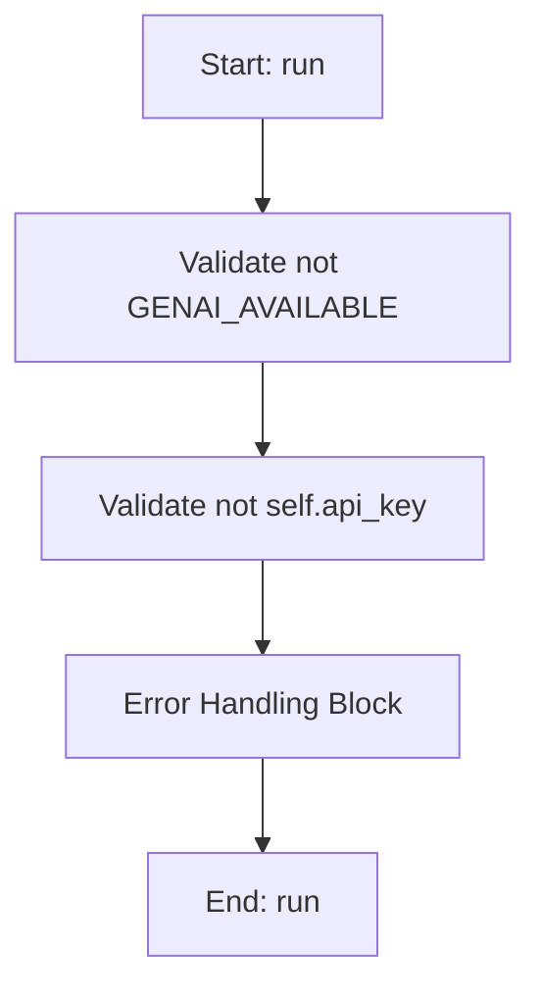

# AIWorker

## Purpose
Worker thread for non-blocking LLM API calls.
Specifically handles Gemini API interactions with RAG context.

## Internal Logic Flow: `run`


### Flowchart Pseudo-code
```python
FUNCTION run(self):
    DO "Validate not GENAI_AVAILABLE"
    DO "Validate not self.api_key"
    DO "Error Handling Block"
END FUNCTION
```

## Methods & Functions

### `__init__`
- **Arguments**: `self, api_key, model_name, system_prompt, user_query, context_data`
- **Returns**: `None`
- **Logic**: Assigns self.api_key; Assigns self.model_name; Assigns self.system_prompt; Assigns self.user_query; Assigns self.context_data

### `run`
- **Arguments**: `self`
- **Returns**: `None`
- **Logic**: Conditional: not GENAI_AVAILABLE; Conditional: not self.api_key

### `get_relevant_docs`
- **Arguments**: `query, doc_dir`
- **Returns**: `str`
- **Logic**: Assigns context_snippets; Assigns keywords; Assigns query_lower; Loops over keywords.items(); Returns result

