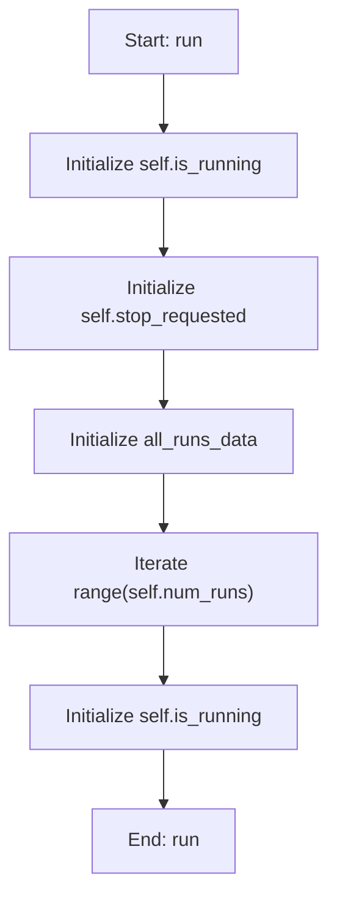

# AdaVEAWorker

## Purpose
Core implementation of AdaVEAWorker logic.

## Internal Logic Flow: `run`


### Flowchart Pseudo-code
```python
FUNCTION run(self):
    DO "Initialize self.is_running"
    DO "Initialize self.stop_requested"
    DO "Initialize all_runs_data"
    DO "Iterate range(self.num_runs)"
    DO "Initialize self.is_running"
END FUNCTION
```

## Methods & Functions

### `__init__`
- **Arguments**: `self, main_system_parameters, dva_parameters, target_values_weights, omega_start, omega_end, omega_points, pop_size, generations, cxpb, mutpb, eta_c, eta_m, num_runs, random_seed, convergence_epsilon, convergence_window, convergence_min_gen, hv_ref_point, heuristic_init_ratio`
- **Returns**: `None`
- **Logic**: Assigns self.main_system_parameters; Assigns self.parameter_names; Assigns self.low_bounds; Assigns self.high_bounds; Assigns self.fixed_params...

### `_evaluate_objectives`
- **Arguments**: `self, individual`
- **Returns**: `None`
- **Logic**: Assigns tau; Assigns alpha; Assigns beta; Assigns n_active; Assigns sum_abs_xi...

### `_heuristic_initialization`
- **Arguments**: `self`
- **Returns**: `None`
- **Logic**: Assigns ind; Loops over range(len(ind)); Returns result

### `run`
- **Arguments**: `self`
- **Returns**: `None`
- **Logic**: Assigns self.is_running; Assigns self.stop_requested; Assigns all_runs_data; Loops over range(self.num_runs); Assigns self.is_running

### `pause`
- **Arguments**: `self`
- **Returns**: `None`
- **Logic**: Assigns self.is_paused

### `resume`
- **Arguments**: `self`
- **Returns**: `None`
- **Logic**: Assigns self.is_paused

### `stop`
- **Arguments**: `self`
- **Returns**: `None`
- **Logic**: Assigns self.stop_requested; Assigns self.is_running; Assigns self.is_paused

