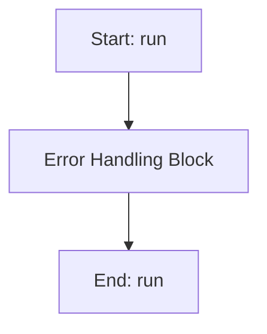

# DEStrategy

## Purpose
Core implementation of DEStrategy logic.

## Internal Logic Flow: `run`


### Flowchart Pseudo-code
```python
FUNCTION run(self):
    DO "Error Handling Block"
END FUNCTION
```

## Methods & Functions

### `__post_init__`
- **Arguments**: `self`
- **Returns**: `None`
- **Logic**: Assigns self.generations; Assigns self.best_fitness_history; Assigns self.mean_fitness_history; Assigns self.diversity_history; Assigns self.parameter_mean_history...

### `__post_init__`
- **Arguments**: `self`
- **Returns**: `None`
- **Logic**: Assigns self.run_best_fitnesses; Assigns self.run_best_solutions; Assigns self.run_convergence_gens; Assigns self.run_execution_times; Assigns self.parameter_distributions

### `__init__`
- **Arguments**: `self, main_params, target_values_dict, weights_dict, omega_start, omega_end, omega_points, de_pop_size, de_num_generations, de_F, de_CR, de_tol, de_parameter_data, alpha, beta, strategy, adaptive_method, adaptive_params, termination_criteria, use_parallel, n_processes, seed, record_statistics, constraint_handling, diversity_preservation, num_runs, track_metrics, use_ml_adaptive, pop_min, pop_max, ml_ucb_c, ml_adapt_population, ml_diversity_weight, ml_diversity_target, use_rl_controller, rl_alpha, rl_gamma, rl_epsilon, rl_epsilon_decay`
- **Returns**: `None`
- **Logic**: Assigns self.main_params; Assigns self.target_values_dict; Assigns self.weights_dict; Assigns self.omega_start; Assigns self.omega_end...

### `run`
- **Arguments**: `self`
- **Returns**: `None`
- **Logic**: Simple function logic.

### `_run_multiple`
- **Arguments**: `self`
- **Returns**: `None`
- **Logic**: Assigns overall_start_time; Assigns parameter_names; Loops over range(self.num_runs); Conditional: not self.should_stop; Assigns best_run_idx...

### `_run_single`
- **Arguments**: `self, return_convergence`
- **Returns**: `None`
- **Logic**: Assigns start_time; Assigns parameter_names; Assigns parameter_bounds; Assigns fixed_parameters; Loops over enumerate(self.de_parameter_da...

### `_create_multi_run_plots`
- **Arguments**: `self, parameter_names`
- **Returns**: `None`
- **Logic**: Simple function logic.

### `_handle_timeout`
- **Arguments**: `self`
- **Returns**: `None`
- **Logic**: Simple function logic.

### `_get_system_info`
- **Arguments**: `self`
- **Returns**: `None`
- **Logic**: Simple function logic.

### `_update_resource_metrics`
- **Arguments**: `self`
- **Returns**: `None`
- **Logic**: Conditional: not self.track_metrics

### `_start_metrics_tracking`
- **Arguments**: `self`
- **Returns**: `None`
- **Logic**: Conditional: not self.track_metrics; Assigns self.metrics['start_time']; Conditional: not self.metrics.get('system_i

### `_stop_metrics_tracking`
- **Arguments**: `self`
- **Returns**: `None`
- **Logic**: Conditional: not self.track_metrics; Assigns self.metrics['end_time']; Conditional: self.metrics.get('start_time')

### `_evaluate_solution`
- **Arguments**: `self, solution`
- **Returns**: `None`
- **Logic**: Assigns param_dict; Loops over enumerate(self.de_parameter_da; Assigns updated_params; Assigns frf_analyzer; Assigns results...

### `evaluate_individual`
- **Arguments**: `self, individual`
- **Returns**: `None`
- **Logic**: Simple function logic.

### `_initialize_population`
- **Arguments**: `self, parameter_bounds, fixed_parameters, num_params`
- **Returns**: `None`
- **Logic**: Assigns population; Returns result

### `_evaluate_population_parallel`
- **Arguments**: `self, population`
- **Returns**: `None`
- **Logic**: Returns result

### `_apply_de_strategy`
- **Arguments**: `self, i, population, global_best, fitnesses, parameter_bounds, fixed_parameters, num_params`
- **Returns**: `None`
- **Logic**: Assigns target; Assigns F; Assigns CR; Assigns idxs; Conditional: self.strategy == DEStrategy.RA...

### `_create_donor_rand_1`
- **Arguments**: `self, x_r1, x_r2, x_r3, F, parameter_bounds, fixed_parameters, num_params`
- **Returns**: `None`
- **Logic**: Assigns donor; Loops over range(num_params); Returns result

### `_create_donor_rand_2`
- **Arguments**: `self, x_r1, x_r2, x_r3, x_r4, x_r5, F, parameter_bounds, fixed_parameters, num_params`
- **Returns**: `None`
- **Logic**: Assigns donor; Loops over range(num_params); Returns result

### `_create_donor_best_1`
- **Arguments**: `self, x_best, x_r1, x_r2, F, parameter_bounds, fixed_parameters, num_params`
- **Returns**: `None`
- **Logic**: Assigns donor; Loops over range(num_params); Returns result

### `_create_donor_best_2`
- **Arguments**: `self, x_best, x_r1, x_r2, x_r3, x_r4, F, parameter_bounds, fixed_parameters, num_params`
- **Returns**: `None`
- **Logic**: Assigns donor; Loops over range(num_params); Returns result

### `_create_donor_current_to_best_1`
- **Arguments**: `self, x_i, x_best, x_r1, x_r2, F, parameter_bounds, fixed_parameters, num_params`
- **Returns**: `None`
- **Logic**: Assigns donor; Loops over range(num_params); Returns result

### `_create_donor_current_to_rand_1`
- **Arguments**: `self, x_i, x_r1, x_r2, x_r3, K, F, parameter_bounds, fixed_parameters, num_params`
- **Returns**: `None`
- **Logic**: Assigns donor; Loops over range(num_params); Returns result

### `_apply_crossover`
- **Arguments**: `self, target, donor, CR, fixed_parameters, num_params`
- **Returns**: `None`
- **Logic**: Assigns trial; Assigns j_rand; Loops over range(num_params); Returns result

### `_handle_constraints`
- **Arguments**: `self, trial, parameter_bounds`
- **Returns**: `None`
- **Logic**: Conditional: self.constraint_handling == 'p

### `_initialize_adaptive_parameters`
- **Arguments**: `self, num_params`
- **Returns**: `None`
- **Logic**: Conditional: self.adaptive_method == Adapti; Conditional: self.adaptive_method == Adapti

### `_adapt_control_parameters`
- **Arguments**: `self, gen, population, fitnesses`
- **Returns**: `None`
- **Logic**: Conditional: self.adaptive_method == Adapti

### `_get_current_F`
- **Arguments**: `self, i`
- **Returns**: `None`
- **Logic**: Conditional: self.adaptive_method == Adapti; Returns result

### `_get_current_CR`
- **Arguments**: `self, i`
- **Returns**: `None`
- **Logic**: Conditional: self.adaptive_method == Adapti; Returns result

### `_calculate_diversity`
- **Arguments**: `self, population`
- **Returns**: `None`
- **Logic**: Conditional: len(population) <= 1; Assigns pop_array; Assigns (n_individuals, n_dimensions); Assigns centroid; Assigns distances...

### `_apply_diversity_preservation`
- **Arguments**: `self, population, fitnesses, parameter_bounds, fixed_parameters`
- **Returns**: `None`
- **Logic**: Assigns diversity; Assigns diversity_threshold; Conditional: diversity < diversity_threshol; Returns result

### `_check_termination`
- **Arguments**: `self, gen, best_fitness, no_improvement_count, diversity`
- **Returns**: `None`
- **Logic**: Conditional: gen >= self.de_num_generations; Conditional: best_fitness <= self.de_tol; Assigns stagnation_limit; Conditional: no_improvement_count >= stagna; Assigns min_diversity...

### `_record_statistics`
- **Arguments**: `self, gen, population, fitnesses, best_individual, best_fitness, start_time, success_rate`
- **Returns**: `None`
- **Logic**: Conditional: not self.record_statistics; Assigns pop_array; Assigns diversity; Conditional: pop_array.size > 0; Conditional: success_rate is not None

### `_create_diagnostic_plots`
- **Arguments**: `self, parameter_names`
- **Returns**: `None`
- **Logic**: Conditional: not self.record_statistics

### `perform_sensitivity_analysis`
- **Arguments**: `self, best_individual, parameter_names, n_samples, plot_results`
- **Returns**: `None`
- **Logic**: Simple function logic.

### `_create_sensitivity_plots`
- **Arguments**: `self, sensitivity_results, parameter_names`
- **Returns**: `None`
- **Logic**: Simple function logic.

### `tune_hyperparameters`
- **Arguments**: `main_params, target_values_dict, weights_dict, omega_start, omega_end, omega_points, de_parameter_data, n_trials, parallel, n_processes`
- **Returns**: `None`
- **Logic**: Assigns pop_sizes; Assigns f_values; Assigns cr_values; Assigns strategies; Conditional: parallel...

### `restart_optimization`
- **Arguments**: `cls, previous_results, main_params, target_values_dict, weights_dict, omega_start, omega_end, omega_points, de_parameter_data, restart_options`
- **Returns**: `None`
- **Logic**: Assigns options; Conditional: restart_options; Assigns best_individual; Conditional: best_individual is None; Assigns refined_parameter_data...

