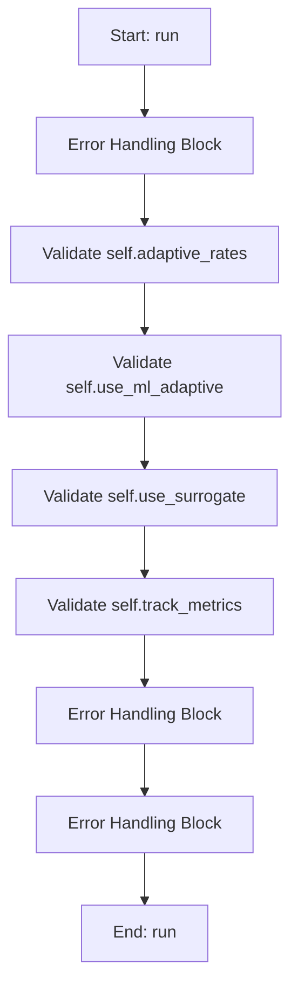

# GAWorker

## Purpose
Background worker thread that executes the Genetic Algorithm (GA).

The heavy optimisation work runs in this thread so the GUI remains responsive.
Progress and results are communicated back to the GUI via Qt signals.

## Internal Logic Flow: `run`


### Flowchart Pseudo-code
```python
FUNCTION run(self):
    DO "Error Handling Block"
    DO "Validate self.adaptive_rates"
    DO "Validate self.use_ml_adaptive"
    DO "Validate self.use_surrogate"
    DO "Validate self.track_metrics"
    DO "Error Handling Block"
    DO "Error Handling Block"
END FUNCTION
```

## Methods & Functions

### `safe_deap_operation`
- **Arguments**: `func`
- **Returns**: `None`
- **Logic**: Returns result

### `build_random_validation_payload`
- **Arguments**: `df, omega_vector, frf_curves`
- **Returns**: `None`
- **Logic**: Assigns payload; Assigns safe_curves; Conditional: isinstance(frf_curves, dict); Assigns payload['frf_curves']; Returns result

### `_attach_frf_peak_positions`
- **Arguments**: `self, results_dict`
- **Returns**: `None`
- **Logic**: Simple function logic.

### `__init__`
- **Arguments**: `self, main_params, target_values_dict, weights_dict, omega_start, omega_end, omega_points, ga_pop_size, ga_num_generations, ga_cxpb, ga_mutpb, ga_tol, ga_parameter_data, alpha, percentage_error_scale, cost_scale_factor, track_metrics, adaptive_rates, stagnation_limit, cxpb_min, cxpb_max, mutpb_min, mutpb_max, use_ml_adaptive, pop_min, pop_max, ml_ucb_c, ml_adapt_population, ml_diversity_weight, ml_diversity_target, ml_historical_weight, ml_current_weight, ml_stag_enabled, ml_stag_limit, use_rl_controller, rl_alpha, rl_gamma, rl_epsilon, rl_epsilon_decay, rl_stag_enabled, rl_stag_limit, rl_w1, rl_w2, rl_w3, rl_w4, rl_cv_target, use_surrogate, surrogate_pool_factor, surrogate_k, surrogate_explore_frac, seeding_method, seeding_seed, use_neural_seeding, neural_acq_type, neural_beta_min, neural_beta_max, neural_epsilon, neural_pool_mult, neural_epochs, neural_time_cap_ms, neural_ensemble_n, neural_hidden, neural_layers, neural_dropout, neural_weight_decay, neural_enable_grad_refine, neural_grad_steps, neural_device, neural_adapt_epsilon, neural_eps_min, neural_eps_max, best_pool_mult, best_diversity_frac, dva_activation_threshold, dva_activation_penalty, dva_costs, dva_costs_by_category, use_enhanced_cost, benefit_w_primary, benefit_w_accuracy, benefit_w_sparsity, cat_w_material, cat_w_manufacturing, cat_w_maintenance, cat_w_operational, benefit_weight_start, benefit_weight_end, generation_ratio, dva_category_map, metrics_timer_interval, metrics_verbose`
- **Returns**: `None`
- **Logic**: Assigns self.main_params; Assigns self.target_values_dict; Assigns self.weights_dict; Assigns self.omega_start; Assigns self.omega_end...

### `__del__`
- **Arguments**: `self`
- **Returns**: `None`
- **Logic**: Assigns self.abort; Assigns self.paused

### `handle_timeout`
- **Arguments**: `self`
- **Returns**: `None`
- **Logic**: Conditional: not self.abort

### `pause`
- **Arguments**: `self`
- **Returns**: `None`
- **Logic**: Assigns self.paused

### `resume`
- **Arguments**: `self`
- **Returns**: `None`
- **Logic**: Assigns self.paused

### `stop`
- **Arguments**: `self`
- **Returns**: `None`
- **Logic**: Assigns self.abort; Assigns self.paused

### `_check_pause_abort`
- **Arguments**: `self`
- **Returns**: `None`
- **Logic**: Assigns aborted; Returns result

### `cleanup`
- **Arguments**: `self`
- **Returns**: `None`
- **Logic**: Conditional: hasattr(creator, 'FitnessMin'); Conditional: hasattr(creator, 'Individual'); Conditional: self.watchdog_timer.isActive()

### `run`
- **Arguments**: `self`
- **Returns**: `None`
- **Logic**: Conditional: self.adaptive_rates; Conditional: self.use_ml_adaptive; Conditional: self.use_surrogate; Conditional: self.track_metrics

### `_get_system_info`
- **Arguments**: `self`
- **Returns**: `None`
- **Logic**: Simple function logic.

### `_update_resource_metrics`
- **Arguments**: `self`
- **Returns**: `None`
- **Logic**: Conditional: not self.track_metrics

### `_start_metrics_tracking`
- **Arguments**: `self`
- **Returns**: `None`
- **Logic**: Conditional: not self.track_metrics; Assigns self.metrics['start_time']

### `_stop_metrics_tracking`
- **Arguments**: `self`
- **Returns**: `None`
- **Logic**: Conditional: not self.track_metrics; Assigns self.metrics['end_time']; Assigns self.metrics['total_duration']; Conditional: len(self.metrics['best_fitness

