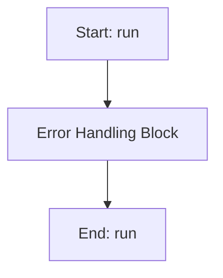

# MOGAWorker

## Purpose
Core implementation of MOGAWorker logic.

## Internal Logic Flow: `run`


### Flowchart Pseudo-code
```python
FUNCTION run(self):
    DO "Error Handling Block"
END FUNCTION
```

## Methods & Functions

### `safe_deap_operation`
- **Arguments**: `func`
- **Returns**: `None`
- **Logic**: Returns result

### `__init__`
- **Arguments**: `self, main_params, dva_params, target_values_weights, omega_start, omega_end, omega_points, pop_size, generations, cxpb, mutpb, eta_c, eta_m, indpb, sparsity_tau, sparsity_alpha, sparsity_beta, num_runs, random_seed, parent`
- **Returns**: `None`
- **Logic**: Assigns self.main_params; Assigns self.parameter_names; Assigns self.low_bounds; Assigns self.high_bounds; Assigns self.fixed_params...

### `stop`
- **Arguments**: `self`
- **Returns**: `None`
- **Logic**: Assigns self.abort

### `pause`
- **Arguments**: `self`
- **Returns**: `None`
- **Logic**: Assigns self.is_paused

### `resume`
- **Arguments**: `self`
- **Returns**: `None`
- **Logic**: Assigns self.is_paused

### `evaluate`
- **Arguments**: `self, individual`
- **Returns**: `None`
- **Logic**: Assigns n_active; Assigns f2; Assigns f3; Returns result

### `run`
- **Arguments**: `self`
- **Returns**: `None`
- **Logic**: Simple function logic.

