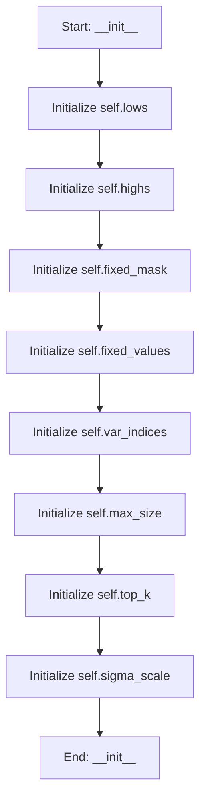

# MemorySeeder

## Purpose
Lightweight AI-like memory seeder that learns and memorizes good seeds across runs.

- Keeps a bounded memory of the best parameter vectors (with lowest fitness)
- Proposes new seeds via a mixture of: replaying top seeds, Gaussian jitter around top-K,
  and uniform exploration within bounds
- Respects fixed parameters
- Persists memory to disk (JSON) to improve over time

## Internal Logic Flow: `__init__`


### Flowchart Pseudo-code
```python
FUNCTION __init__(self, lows, highs, fixed_mask, fixed_values, max_size, top_k, sigma_scale, exploration_frac, replay_frac, file_path, seed):
    DO "Initialize self.lows"
    DO "Initialize self.highs"
    DO "Initialize self.fixed_mask"
    DO "Initialize self.fixed_values"
    DO "Initialize self.var_indices"
    DO "Initialize self.max_size"
    DO "Initialize self.top_k"
    DO "Initialize self.sigma_scale"
END FUNCTION
```

## Methods & Functions

### `__init__`
- **Arguments**: `self, lows, highs, fixed_mask, fixed_values, max_size, top_k, sigma_scale, exploration_frac, replay_frac, file_path, seed`
- **Returns**: `None`
- **Logic**: Assigns self.lows; Assigns self.highs; Assigns self.fixed_mask; Assigns self.fixed_values; Assigns self.var_indices...

### `size`
- **Arguments**: `self`
- **Returns**: `int`
- **Logic**: Returns result

### `_load`
- **Arguments**: `self`
- **Returns**: `None`
- **Logic**: Simple function logic.

### `_save`
- **Arguments**: `self`
- **Returns**: `None`
- **Logic**: Simple function logic.

### `add_data`
- **Arguments**: `self, X, y`
- **Returns**: `None`
- **Logic**: Conditional: not X or not y

### `_rand_var`
- **Arguments**: `self, n`
- **Returns**: `np.ndarray`
- **Logic**: Conditional: self.var_indices.size == 0; Assigns Z; Assigns lows; Assigns highs; Assigns span...

### `_jitter_around`
- **Arguments**: `self, bases, n`
- **Returns**: `np.ndarray`
- **Logic**: Conditional: n <= 0; Conditional: bases.size == 0 or self.var_in; Assigns lows; Assigns highs; Assigns span...

### `propose`
- **Arguments**: `self, count`
- **Returns**: `List[List[float]]`
- **Logic**: Conditional: count <= 0; Conditional: self.size == 0; Assigns n_replay; Assigns n_explore; Assigns n_model...

