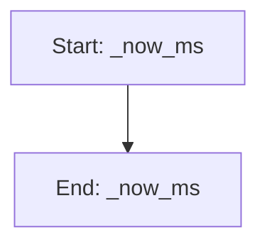

# NeuralSeeder

## Purpose
Online-learning seeding via an ensemble of small MLPs.

- Maintains dataset of evaluated (x, y). x provided in original scale; class normalizes to [0,1] over variable dims.
- Trains a small ensemble each generation under a wall-clock time cap.
- Proposes seeds via uncertainty-aware acquisition (UCB or EI) over a candidate pool.
- Supports epsilon exploration and diversity filtering; optional gradient refinement.
- Honors fixed parameters exactly and respects provided bounds when decoding.

## Internal Logic Flow: `_now_ms`


### Flowchart Pseudo-code
```python
FUNCTION _now_ms():
END FUNCTION
```

## Methods & Functions

### `_now_ms`
- **Arguments**: ``
- **Returns**: `float`
- **Logic**: Returns result

### `__init__`
- **Arguments**: `self, lows, highs, fixed_mask, fixed_values, ensemble_n, hidden, layers, dropout, weight_decay, epochs, time_cap_ms, pool_mult, epsilon, acq_type, device, seed, diversity_min_dist, enable_grad_refine, grad_steps`
- **Returns**: `None`
- **Logic**: Assigns self.lows; Assigns self.highs; Assigns self.fixed_mask; Assigns self.fixed_values; Assigns self.var_indices...

### `_to_z`
- **Arguments**: `self, X`
- **Returns**: `np.ndarray`
- **Logic**: Assigns lows; Assigns highs; Assigns span; Returns result

### `_from_z`
- **Arguments**: `self, Z`
- **Returns**: `np.ndarray`
- **Logic**: Assigns X; Assigns X[:, :]; Assigns lows; Assigns highs; Assigns span...

### `size`
- **Arguments**: `self`
- **Returns**: `int`
- **Logic**: Returns result

### `add_data`
- **Arguments**: `self, X, y`
- **Returns**: `None`
- **Logic**: Conditional: X is None or y is None or len(; Assigns X_arr; Assigns y_arr; Assigns y_arr; Assigns y_arr...

### `_train_torch`
- **Arguments**: `self`
- **Returns**: `Tuple[float, int]`
- **Logic**: Conditional: not self._torch_ok or self.siz; Assigns start_ms; Assigns X; Assigns y; Assigns Z...

### `train`
- **Arguments**: `self`
- **Returns**: `Tuple[float, int]`
- **Logic**: Conditional: not self._torch_ok

### `_predict_mu_sigma`
- **Arguments**: `self, X`
- **Returns**: `Tuple[np.ndarray, np.ndarray]`
- **Logic**: Conditional: not self._torch_ok or not self; Assigns Z; Assigns Zt; Assigns preds; Assigns P...

### `_acq_scores`
- **Arguments**: `self, mu, sigma, best_y, beta`
- **Returns**: `np.ndarray`
- **Logic**: Conditional: self.acq_type == 'ei'; Returns result

### `_diversity_filter`
- **Arguments**: `self, Z, idx_sorted, k`
- **Returns**: `List[int]`
- **Logic**: Conditional: k <= 0 or idx_sorted.size == 0; Loops over idx_sorted; Assigns i; Returns result

### `propose`
- **Arguments**: `self, count, beta, best_y, exploration_fraction`
- **Returns**: `List[List[float]]`
- **Logic**: Conditional: count <= 0; Assigns pool_n; Conditional: SCIPY_QMC_AVAILABLE and self.i; Conditional: self.enable_grad_refine and se; Assigns X_pool...

### `predict_mean`
- **Arguments**: `self, X`
- **Returns**: `np.ndarray`
- **Logic**: Assigns X_arr; Assigns (mu, _); Returns result

### `predict_mu_sigma`
- **Arguments**: `self, X`
- **Returns**: `Tuple[np.ndarray, np.ndarray]`
- **Logic**: Assigns X_arr; Assigns (mu, sigma); Returns result

