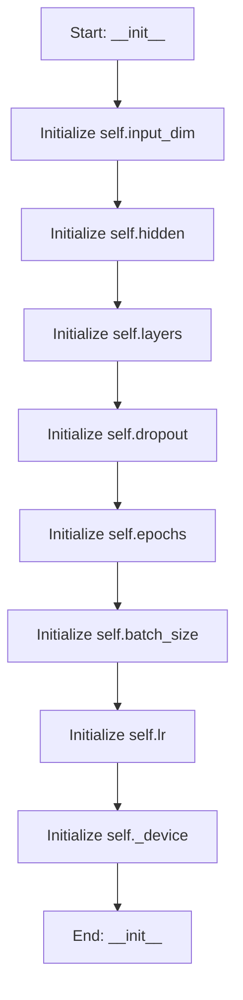

# NeuralSurrogate

## Purpose
A Neural Network Surrogate that replaces KNN for candidate screening.

Analogy: The "Seasoned Expert" who predicts performance without doing the math.

## Internal Logic Flow: `__init__`


### Flowchart Pseudo-code
```python
FUNCTION __init__(self, input_dim, hidden, layers, dropout, epochs, batch_size, lr, device):
    DO "Initialize self.input_dim"
    DO "Initialize self.hidden"
    DO "Initialize self.layers"
    DO "Initialize self.dropout"
    DO "Initialize self.epochs"
    DO "Initialize self.batch_size"
    DO "Initialize self.lr"
    DO "Initialize self._device"
END FUNCTION
```

## Methods & Functions

### `__init__`
- **Arguments**: `self, input_dim, hidden, layers, dropout, epochs, batch_size, lr, device`
- **Returns**: `None`
- **Logic**: Assigns self.input_dim; Assigns self.hidden; Assigns self.layers; Assigns self.dropout; Assigns self.epochs...

### `train`
- **Arguments**: `self, X, y`
- **Returns**: `None`
- **Logic**: Conditional: not TORCH_AVAILABLE or self._m; Assigns X_t; Assigns y_t; Assigns dataset; Assigns loader...

### `predict`
- **Arguments**: `self, X`
- **Returns**: `np.ndarray`
- **Logic**: Conditional: not TORCH_AVAILABLE or self._m

### `get_fitness_gradient`
- **Arguments**: `self, X`
- **Returns**: `np.ndarray`
- **Logic**: Conditional: not TORCH_AVAILABLE or self._m; Assigns X_t; Assigns preds; Assigns total_pred; Returns result

