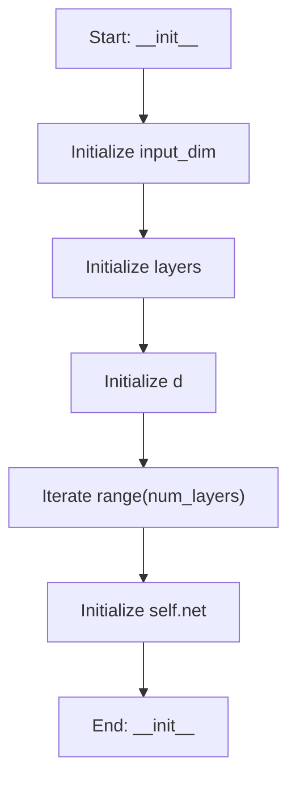

# PhysicsInformedFRF

## Purpose
A Neural Network that solves the Frequency Response Function (FRF).

Analogy: The "Mechanical Intuition" brain. It doesn't just memorize data; 
it understands the Newton's Laws that govern vibrations.

## Internal Logic Flow: `__init__`


### Flowchart Pseudo-code
```python
FUNCTION __init__(self, param_dim, hidden_dim, num_layers):
    DO "Initialize input_dim"
    DO "Initialize layers"
    DO "Initialize d"
    DO "Iterate range(num_layers)"
    DO "Initialize self.net"
END FUNCTION
```

## Methods & Functions

### `__init__`
- **Arguments**: `self, param_dim, hidden_dim, num_layers`
- **Returns**: `None`
- **Logic**: Assigns input_dim; Assigns layers; Assigns d; Loops over range(num_layers); Assigns self.net

### `forward`
- **Arguments**: `self, params, omega`
- **Returns**: `torch.Tensor`
- **Logic**: Assigns x; Returns result

### `__init__`
- **Arguments**: `self, param_dim, device`
- **Returns**: `None`
- **Logic**: Assigns self.device; Assigns self.model; Assigns self.optimizer; Assigns self.criterion

### `physics_residual`
- **Arguments**: `self, params, omega, pred_amp`
- **Returns**: `None`
- **Logic**: Simple function logic.

### `train_step`
- **Arguments**: `self, params, omega, target_amp`
- **Returns**: `None`
- **Logic**: Assigns p_t; Conditional: omega.ndim == 1; Assigns y_t; Assigns pred; Assigns loss_data...

### `predict`
- **Arguments**: `self, params, omega_range`
- **Returns**: `np.ndarray`
- **Logic**: Simple function logic.

### `load_weights`
- **Arguments**: `self, file_path`
- **Returns**: `None`
- **Logic**: Conditional: not file_path or not os.path.e

### `save_weights`
- **Arguments**: `self, file_path`
- **Returns**: `None`
- **Logic**: Simple function logic.

