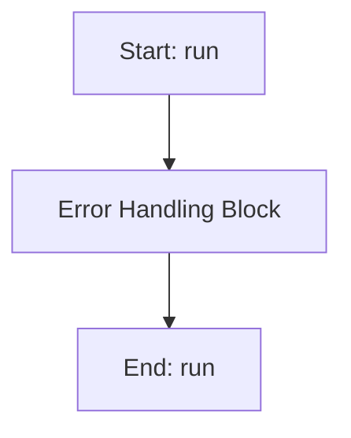

# GearboxPINN

## Purpose
Core implementation of GearboxPINN logic.

## Internal Logic Flow: `run`


### Flowchart Pseudo-code
```python
FUNCTION run(self):
    DO "Error Handling Block"
END FUNCTION
```

## Methods & Functions

### `__init__`
- **Arguments**: `self, P, layers, neurons, activation, use_fourier, omega_max, n_freqs, topology_mask`
- **Returns**: `None`
- **Logic**: Assigns self.P; Assigns self.use_fourier; Assigns input_dim; Conditional: use_fourier; Assigns act...

### `get_matrices`
- **Arguments**: `self`
- **Returns**: `None`
- **Logic**: Assigns M; Assigns K_pos; Assigns C_pos; Assigns K_conn; Assigns K_conn_sym...

### `forward`
- **Arguments**: `self, t`
- **Returns**: `None`
- **Logic**: Conditional: self.use_fourier; Returns result

### `__init__`
- **Arguments**: `self, t_data, x_data, v_data, a_data, P, layers, neurons, adam_epochs, lbfgs_epochs, lr, lambda_f, lambda_data, lambda_ic, lambda_reg, use_fourier, omega_max, n_freqs, topology_mask, warmup_epochs`
- **Returns**: `None`
- **Logic**: Assigns self.t_data; Assigns self.x_data; Assigns self.v_data; Assigns self.a_data; Assigns self.P...

### `stop`
- **Arguments**: `self`
- **Returns**: `None`
- **Logic**: Assigns self.abort

### `physics_loss`
- **Arguments**: `self, model, t_col`
- **Returns**: `None`
- **Logic**: Assigns t_col; Assigns x_hat; Assigns (M, C, K); Assigns v_hat; Loops over range(self.P)...

### `run`
- **Arguments**: `self`
- **Returns**: `None`
- **Logic**: Simple function logic.

