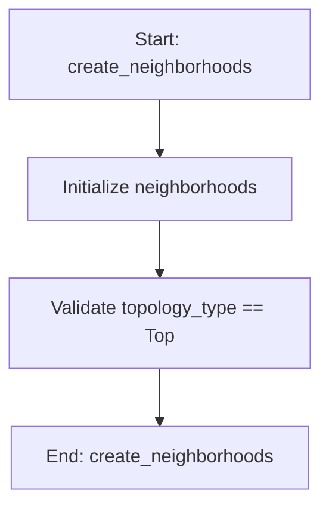

# TopologyType

## Purpose
Topology types for PSO neighborhood structures.

Different topologies affect information flow through the swarm:
- GLOBAL: All particles connected, fastest convergence but may get trapped in local optima
- RING: Each particle connected to two neighbors, slower convergence but better exploration
- VON_NEUMANN: Grid-like neighborhood structure balancing exploration and exploitation
- RANDOM: Random connections that change periodically, enhancing diversity

## Internal Logic Flow: `create_neighborhoods`


### Flowchart Pseudo-code
```python
FUNCTION create_neighborhoods(self, swarm_size, topology_type):
    DO "Initialize neighborhoods"
    DO "Validate topology_type == Top"
END FUNCTION
```

## Methods & Functions

### `__init__`
- **Arguments**: `self, main_params, target_values_dict, weights_dict, omega_start, omega_end, omega_points, pso_swarm_size, pso_num_iterations, pso_w, pso_w_damping, pso_c1, pso_c2, pso_tol, pso_parameter_data, alpha, adaptive_params, topology, mutation_rate, max_velocity_factor, stagnation_limit, boundary_handling, early_stopping, early_stopping_iters, early_stopping_tol, diversity_threshold, quasi_random_init, track_metrics, use_ml_adaptive, pop_min, pop_max, ml_ucb_c, ml_adapt_population, ml_diversity_weight, ml_diversity_target, use_rl_controller, rl_alpha, rl_gamma, rl_epsilon, rl_epsilon_decay`
- **Returns**: `None`
- **Logic**: Assigns self._terminate_flag; Assigns self.main_params; Assigns self.target_values_dict; Assigns self.weights_dict; Assigns self.omega_start...

### `adaptive_inertia_weight`
- **Arguments**: `self, iter_num, max_iter, best_fitness, avg_fitness, diversity`
- **Returns**: `None`
- **Logic**: Conditional: max_iter <= 1; Assigns w_linear; Assigns n; Assigns w_nonlinear; Conditional: avg_fitness == 0 or best_fitne...

### `adaptive_acceleration_coefficients`
- **Arguments**: `self, iter_num, max_iter, diversity`
- **Returns**: `None`
- **Logic**: Conditional: max_iter <= 1; Assigns (c1_min, c1_max); Assigns (c2_min, c2_max); Assigns progress; Assigns c1_time...

### `calculate_diversity`
- **Arguments**: `self, swarm, parameter_bounds`
- **Returns**: `None`
- **Logic**: Conditional: not swarm; Assigns num_particles; Conditional: num_particles <= 1; Assigns num_dimensions; Assigns centroid...

### `create_neighborhoods`
- **Arguments**: `self, swarm_size, topology_type`
- **Returns**: `None`
- **Logic**: Assigns neighborhoods; Conditional: topology_type == TopologyType.; Returns result

### `update_neighborhoods`
- **Arguments**: `self, iteration`
- **Returns**: `None`
- **Logic**: Conditional: self.topology == TopologyType.

### `handle_boundary_violation`
- **Arguments**: `self, position, velocity, dim, low, high`
- **Returns**: `None`
- **Logic**: Conditional: low <= position <= high; Conditional: self.boundary_handling == 'abs; Conditional: position < low

### `apply_mutation`
- **Arguments**: `self, position, parameter_bounds, fixed_parameters`
- **Returns**: `None`
- **Logic**: Assigns mutated_position; Loops over range(len(position)); Returns result

### `quasi_random_initialize`
- **Arguments**: `self, num_params, parameter_bounds, fixed_parameters, num_particles`
- **Returns**: `None`
- **Logic**: Assigns sampler; Assigns samples; Assigns positions; Loops over range(num_particles); Returns result

### `run`
- **Arguments**: `self`
- **Returns**: `None`
- **Logic**: Simple function logic.

### `_handle_timeout`
- **Arguments**: `self`
- **Returns**: `None`
- **Logic**: Simple function logic.

### `_get_system_info`
- **Arguments**: `self`
- **Returns**: `None`
- **Logic**: Simple function logic.

### `_update_resource_metrics`
- **Arguments**: `self`
- **Returns**: `None`
- **Logic**: Conditional: not self.track_metrics

### `_start_metrics_tracking`
- **Arguments**: `self`
- **Returns**: `None`
- **Logic**: Conditional: not self.track_metrics; Assigns self.metrics['start_time']; Conditional: not self.metrics.get('system_i

### `_stop_metrics_tracking`
- **Arguments**: `self`
- **Returns**: `None`
- **Logic**: Conditional: not self.track_metrics; Assigns self.metrics['end_time']; Conditional: self.metrics.get('start_time')

### `evaluate_particle`
- **Arguments**: `self, position, parameter_bounds`
- **Returns**: `None`
- **Logic**: Simple function logic.

### `terminate`
- **Arguments**: `self`
- **Returns**: `None`
- **Logic**: Assigns self._terminate_flag

### `is_terminated`
- **Arguments**: `self`
- **Returns**: `None`
- **Logic**: Returns result

