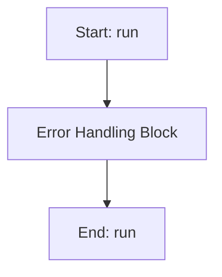

# SAWorker

## Purpose
Core implementation of SAWorker logic.

## Internal Logic Flow: `run`


### Flowchart Pseudo-code
```python
FUNCTION run(self):
    DO "Error Handling Block"
END FUNCTION
```

## Methods & Functions

### `__init__`
- **Arguments**: `self, main_params, target_values_dict, weights_dict, omega_start, omega_end, omega_points, sa_initial_temp, sa_cooling_rate, sa_num_iterations, sa_tol, sa_parameter_data, alpha, percentage_error_scale, track_metrics, use_ml_adaptive, ml_ucb_c, ml_accept_target, use_rl_controller, rl_alpha, rl_gamma, rl_epsilon, rl_epsilon_decay, step_scale`
- **Returns**: `None`
- **Logic**: Assigns self.main_params; Assigns self.target_values_dict; Assigns self.weights_dict; Assigns self.omega_start; Assigns self.omega_end...

### `run`
- **Arguments**: `self`
- **Returns**: `None`
- **Logic**: Simple function logic.

### `evaluate_candidate`
- **Arguments**: `self, candidate`
- **Returns**: `None`
- **Logic**: Simple function logic.

### `_get_system_info`
- **Arguments**: `self`
- **Returns**: `None`
- **Logic**: Simple function logic.

### `_update_resource_metrics`
- **Arguments**: `self`
- **Returns**: `None`
- **Logic**: Conditional: not self.track_metrics

### `_start_metrics_tracking`
- **Arguments**: `self`
- **Returns**: `None`
- **Logic**: Conditional: not self.track_metrics; Assigns self.metrics['start_time']; Conditional: not self.metrics.get('system_i

### `_stop_metrics_tracking`
- **Arguments**: `self`
- **Returns**: `None`
- **Logic**: Conditional: not self.track_metrics; Assigns self.metrics['end_time']; Conditional: self.metrics.get('start_time')

### `_handle_timeout`
- **Arguments**: `self`
- **Returns**: `None`
- **Logic**: Simple function logic.

