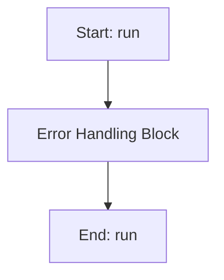

# SobolWorker

## Purpose
Core implementation of SobolWorker logic.

## Internal Logic Flow: `run`


### Flowchart Pseudo-code
```python
FUNCTION run(self):
    DO "Error Handling Block"
END FUNCTION
```

## Methods & Functions

### `__init__`
- **Arguments**: `self, main_params, dva_bounds, dva_order, omega_start, omega_end, omega_points, num_samples_list, target_values_dict, weights_dict, n_jobs`
- **Returns**: `None`
- **Logic**: Assigns self.main_params; Assigns self.dva_bounds; Assigns self.dva_order; Assigns self.omega_start; Assigns self.omega_end...

### `run`
- **Arguments**: `self`
- **Returns**: `None`
- **Logic**: Simple function logic.

