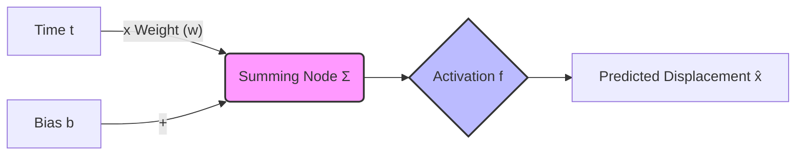
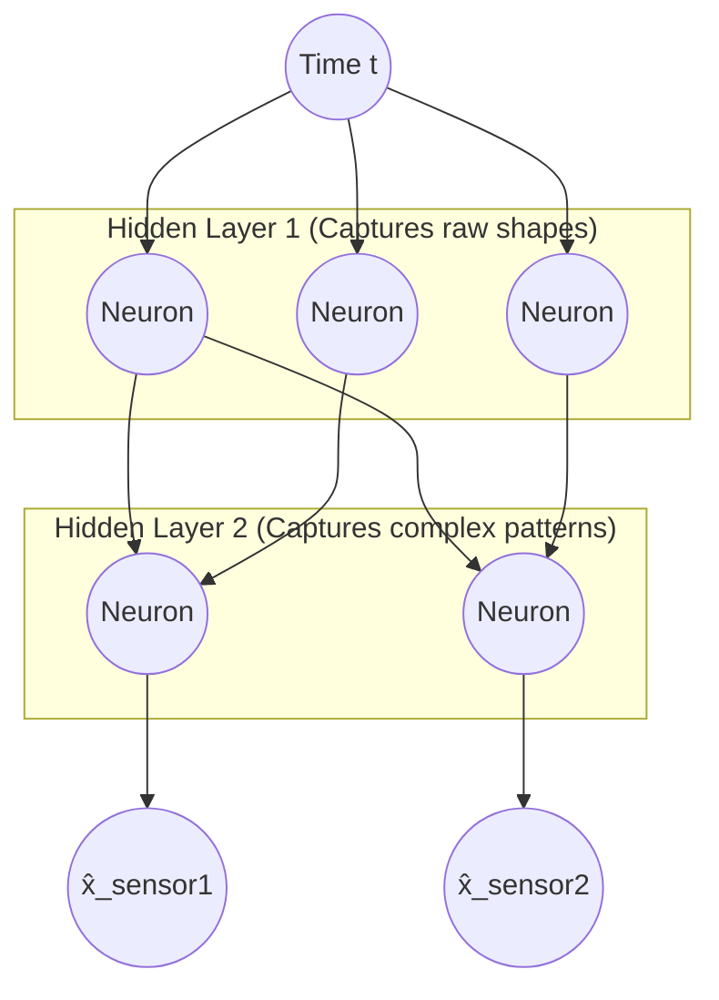
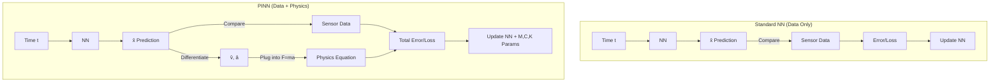
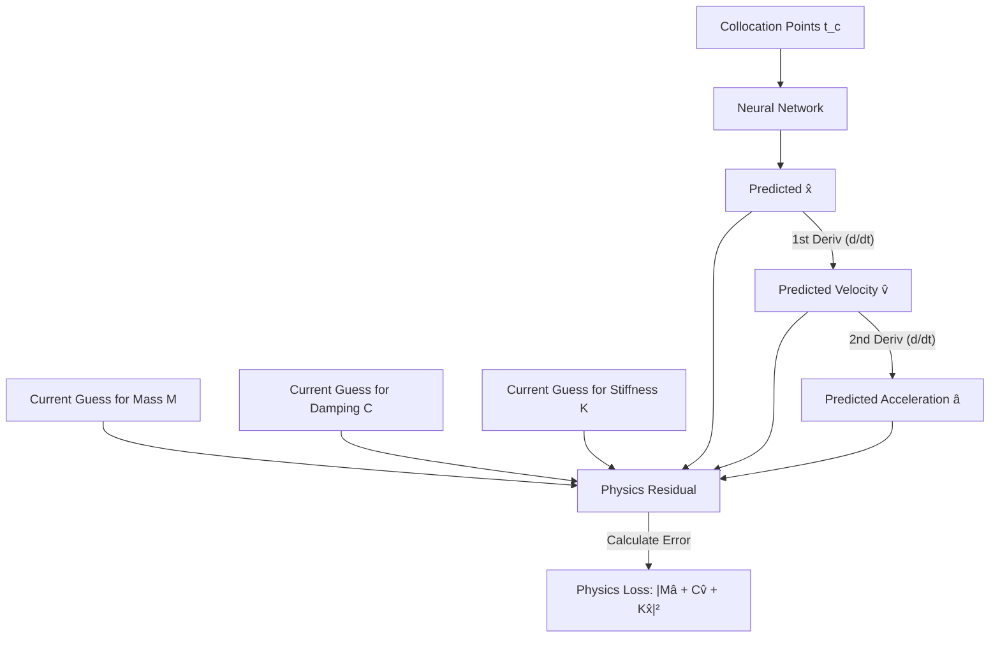
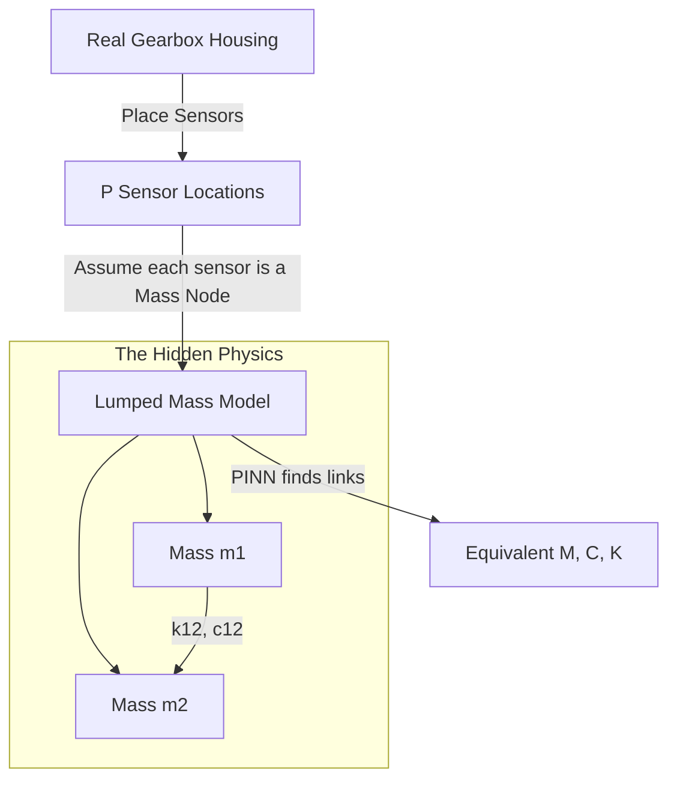
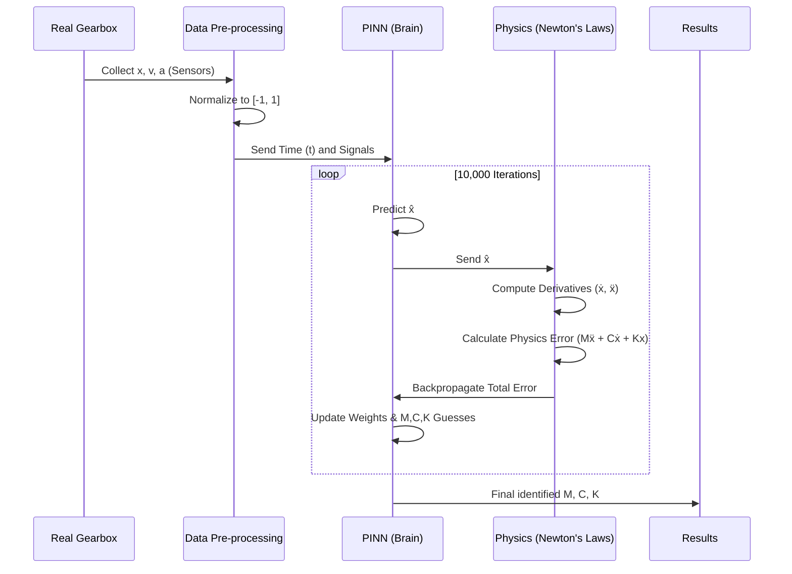
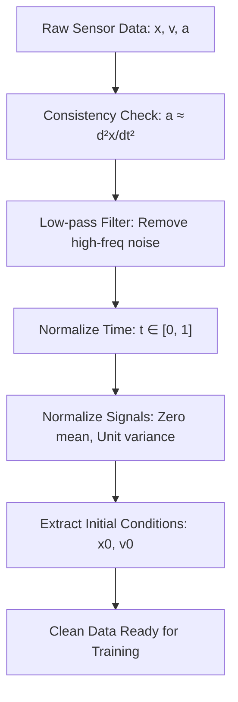
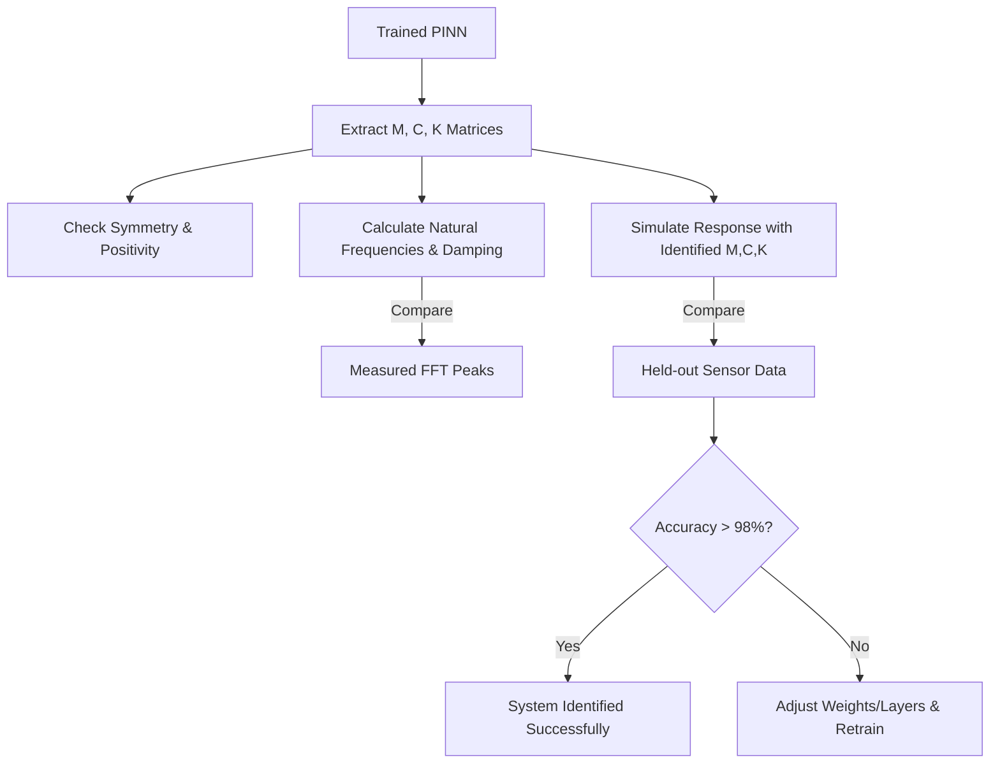

# Physics-Informed Neural Networks for Vibration System Identification
### From Discrete Multi-DOF Equations of Motion to Continuous Gearbox M-C-K Identification

***

## Executive Summary

Physics-Informed Neural Networks (PINNs) are a powerful hybrid framework that merge neural networks with the governing differential equations of physical systems. For vibration systems, they solve the **inverse problem**: given sensor measurements of displacement, velocity, and acceleration, find the mass matrix **M**, damping matrix **C**, and stiffness matrix **K** that govern the system. This is achieved by embedding Newton's second law directly into the neural network's loss function and treating the physical parameters as additional trainable variables. Inverse PINNs have demonstrated parameter estimation errors below 2% even on noisy data, with strong robustness to sparse sensor placement.[^1][^2][^3][^4][^5][^6][^7]

***

## Part 0 — Neural Networks for Absolute Beginners: A Visual Guide

If you have never worked with Neural Networks (NNs), think of them as **"Self-Correcting Math Machines."** 

### 1. What is a "Neuron"?
In math, a neuron is just a simple formula: \(y = f(w \cdot t + b)\).
- **\(t\)**: Your input (Time).
- **\(w\)**: The **Weight**. It tells the network how important this time point is.
- **\(b\)**: The **Bias**. It shifts the signal up or down.
- **\(f\)**: The **Activation Function**. This is the most important part—it adds "curves" to the math so it can represent vibrations.



### 2. Deep Networks: The "Brain" Structure
When we say "Deep Learning," we mean we stack hundreds of these neurons in layers. This allows the network to "learn" the complex ripples and patterns of a gearbox vibrating at high speeds.



### 3. How it Learns (The Training Loop)
1.  **Guess:** The network makes a random guess about the vibration.
2.  **Check:** It compares its guess to the real sensor data.
3.  **Correct:** It uses an "Optimizer" to tweak the weights slightly to be more accurate next time.
4.  **Repeat:** It does this 10,000 times until the guess matches the reality.

***

## Part I — What Is a PINN?

### The Core Concept

A standard neural network learns a mapping from inputs to outputs purely from data. A PINN augments this by adding a **physics residual term** to the loss function. Instead of just minimizing the mismatch between predictions and measurements, the PINN simultaneously minimizes the extent to which the network's output **violates the governing differential equations**.[^2][^3]

The key enabling technology is **automatic differentiation (AD)**: PyTorch and TensorFlow can compute exact derivatives of the neural network output with respect to its inputs via backpropagation through the computational graph. This allows the PINN to evaluate \(\hat{\ddot{\mathbf{x}}} = \partial^2 \hat{\mathbf{x}} / \partial t^2\) at any time point without finite differences or mesh discretization.[^8][^1]

### Comparison: Standard NN vs. PINN Logic



### Forward vs. Inverse PINNs (Choosing the Mode)

| Mode | Known | Unknown | Why Choose This? |
|------|-------|---------|------------------|
| **Forward PINN** | M, C, K matrices | Displacement x(t) | **Simulation:** Choose this if you have a blueprint and want to predict how it will shake without building it. |
| **Inverse PINN** | Sensor data x(t), v(t), a(t) | M, C, K values | **Identification:** **Chosen for this project.** We have a real gearbox with sensors; we want to "reverse-engineer" its physical health (stiffness/mass). |

For a gearbox with random sensors, the **Inverse PINN** is used. The unknown physical parameters are declared as `nn.Parameter` in PyTorch and optimized jointly with the network weights via gradient descent.[^9][^6][^10][^7]

***

## Part II — Discrete Vibrational Systems: Any N Degrees of Freedom

### Equations of Motion — Matrix Form

The universal governing equation for any N-DOF discrete vibrational system is:[^11][^12]

\[
\mathbf{M}\ddot{\mathbf{x}}(t) + \mathbf{C}\dot{\mathbf{x}}(t) + \mathbf{K}\mathbf{x}(t) = \mathbf{f}(t)
\]

where \(\mathbf{x}(t) \in \mathbb{R}^N\) is the displacement vector and \(\mathbf{M}, \mathbf{C}, \mathbf{K} \in \mathbb{R}^{N \times N}\) are the mass, damping, and stiffness matrices.

For a **2-DOF chain system** (two masses connected by springs):

\[
\mathbf{M} = \begin{bmatrix} m_1 & 0 \\ 0 & m_2 \end{bmatrix}, \quad
\mathbf{C} = \begin{bmatrix} c_1+c_2 & -c_2 \\ -c_2 & c_2+c_3 \end{bmatrix}, \quad
\mathbf{K} = \begin{bmatrix} k_1+k_2 & -k_2 \\ -k_2 & k_2+k_3 \end{bmatrix}
\]

A two-DOF PINN framework was demonstrated to identify a nonlinear spring coefficient \(k_n\) with only 0.67% error from limited simulation data. For a damped harmonic oscillator (1-DOF), inverse PINNs estimated damping and stiffness with under 2% relative error and remained robust under moderate observational noise.[^4][^1]

### General N-DOF Tridiagonal Stiffness (Chain Topology)

\[
\mathbf{K} = \begin{bmatrix}
k_1+k_2 & -k_2 & 0 & \cdots & 0 \\
-k_2 & k_2+k_3 & -k_3 & \cdots & 0 \\
0 & -k_3 & k_3+k_4 & \cdots & 0 \\
\vdots & & & \ddots & \vdots \\
0 & 0 & 0 & \cdots & k_{N-1}+k_N
\end{bmatrix}
\]

For **arbitrary topologies**, the rule is:
- \(K_{ii} = \sum_{\text{springs at node } i} k_s\) (diagonal = sum of attached springs)
- \(K_{ij} = -k_s\) if spring \(s\) connects nodes \(i\) and \(j\)

The same pattern applies for **C** using damper coefficients \(c_s\).

### State-Space First-Order Form

PINNs work most naturally with first-order systems. Defining the state vector \(\mathbf{q} = [\mathbf{x}^T, \dot{\mathbf{x}}^T]^T \in \mathbb{R}^{2N}\):

\[
\dot{\mathbf{q}} = \begin{bmatrix} \mathbf{0} & \mathbf{I} \\ -\mathbf{M}^{-1}\mathbf{K} & -\mathbf{M}^{-1}\mathbf{C} \end{bmatrix} \mathbf{q} + \begin{bmatrix} \mathbf{0} \\ \mathbf{M}^{-1}\mathbf{f} \end{bmatrix}
\]

This reduces second-order ODEs to first-order, which stabilizes training and allows auxiliary outputs to be defined for velocity terms.[^1]

***

## Part III — The PINN Architecture

### Network Design Requirements

The neural network maps scalar time \(t\) to the N displacement outputs:[^4][^1]

```
Input:  t (1 neuron)
Hidden: 5 layers × 64 neurons, tanh activation  ← CRITICAL
Output: [x̂₁(t), x̂₂(t), ..., x̂ₙ(t)]
```

### Explaining Activation Modes: Why Tanh?

An activation function is the "personality" of the neuron. Here are the common modes:

| Mode | Math | Visual | Suitability for Physics | Why Chosen? |
|------|------|--------|-------------------------|-------------|
| **ReLU** | \(max(0, x)\) | Straight line with a corner | **Fails.** The 2nd derivative is zero everywhere. You cannot calculate acceleration. | Never use for vibrations. |
| **Sigmoid** | \(1/(1+e^{-x})\) | Smooth S-curve (0 to 1) | **Poor.** Can lead to "dead" neurons where the network stops learning. | Old-fashioned. |
| **Tanh** | \(tanh(x)\) | Smooth S-curve (-1 to 1) | **Excellent.** It is "smooth" (\(C^\infty\)) meaning you can differentiate it forever. | **CHOSEN.** It handles the back-and-forth oscillations of vibrations perfectly. |
| **Sin (SIREN)** | \(sin(x)\) | Periodic wave | **Advanced.** Naturally represents frequencies. | Great for high-frequency gears, but harder to train. |

**Why `tanh`?** PINNs require smooth, twice-differentiable activations because accelerations are computed as second derivatives of the network output. ReLU gives zero second derivatives everywhere and is completely unusable for this application.[^13]

### Two Classes of Trainable Parameters

The PINN simultaneously optimizes two types of parameters:

| Type | Symbol | Implementation | Role |
|------|--------|----------------|------|
| Network weights | \(\boldsymbol{\theta}\) | Standard `nn.Linear` | The "Artist": Learns the shape of the wave. |
| Physical parameters | \(\hat{m}_i, \hat{c}_i, \hat{k}_i\) | `nn.Parameter` | The "Engineer": Finds the mass/stiffness of the gear. |

Physical parameters should be **log-parameterized** to enforce positivity without constrained optimization:[^7]

```python
m_i = torch.exp(log_m_i)   # guaranteed positive (Mass can't be negative!)
k_ij = torch.exp(log_k_ij) # guaranteed positive (Springs must resist!)
```

***

## Part IV — The Loss Function

### Three-Component Total Loss

\[
\mathcal{L}_{\text{total}} = \lambda_f \mathcal{L}_{\text{physics}} + \lambda_d \mathcal{L}_{\text{data}} + \lambda_0 \mathcal{L}_{\text{IC}}
\]

This is the canonical loss formulation established by Raissi et al. (2019) and extended for structural parameter identification.[^6][^2][^1]

### Component 1: Physics Loss (ODE Residual)



At \(N_c\) collocation points \(\{t_j^c\}\) sampled uniformly across the time domain:[^5][^1]

\[
\mathcal{L}_{\text{physics}} = \frac{1}{N_c} \sum_{j=1}^{N_c} \left\| \mathbf{M}\hat{\ddot{\mathbf{x}}}(t_j^c) + \mathbf{C}\hat{\dot{\mathbf{x}}}(t_j^c) + \mathbf{K}\hat{\mathbf{x}}(t_j^c) - \mathbf{f}(t_j^c) \right\|^2
\]

Derivatives \(\hat{\dot{\mathbf{x}}}\) and \(\hat{\ddot{\mathbf{x}}}\) are computed via `torch.autograd.grad` with `create_graph=True` to enable double differentiation.[^14][^8]

### Component 2: Data Loss

At sensor measurement times \(\{t_i^d\}\):[^15][^6]

\[
\mathcal{L}_{\text{data}} = \frac{1}{N_d \cdot P} \sum_{i=1}^{N_d} \sum_{s=1}^{P} \left( \hat{x}_s(t_i^d) - x_s^{\text{meas}} \right)^2
\]

Since the gearbox problem provides \(x(t)\), \(v(t)\), and \(a(t)\), the data loss is extended to all three:[^10]

\[
\mathcal{L}_{\text{data}} = \mathcal{L}_{x} + \mathcal{L}_{v} + \mathcal{L}_{a}
\]

Having all three signals is a major advantage: acceleration directly constrains **M**, velocity constrains **C**, and displacement constrains **K** in the residual equation.

### Component 3: Initial Condition Loss

\[
\mathcal{L}_{\text{IC}} = \left\| \hat{\mathbf{x}}(t_0) - \mathbf{x}_0 \right\|^2 + \left\| \hat{\dot{\mathbf{x}}(t_0) - \mathbf{v}_0 \right\|^2
\]

### Explaining Optimizer Modes: How the Machine Learns

The **Optimizer** is the brain's "Logic Mode."

| Mode | Algorithm | Strategy | Why Choose? |
|------|-----------|----------|-------------|
| **SGD** | Stochastic Gradient Descent | Take a step based on one data point. | **Too noisy.** Often gets lost in PINNs. |
| **Adam** | Adaptive Moment Estimation | Keeps a "momentum" of past steps. | **Phase 1 Choice.** Excellent for finding the "general area" of the solution quickly. |
| **L-BFGS** | Limited-memory Broyden–Fletcher–Goldfarb–Shanno | Uses curvature (2nd derivatives) to teleport to the bottom. | **Phase 2 Choice.** **CHOSEN for final accuracy.** It is "surgical" and finds the exact M,C,K values. |

**The Winning Strategy:** Start with **Adam** for 5,000 steps to get the general shape, then switch to **L-BFGS** to lock in the physical parameters.

***

## Part V — Gearbox: Continuous System to Lumped Equivalent

### The Physical Problem

A real gearbox is a **continuous elastic structure**. You have placed \(P\) sensors at random locations and recorded \(x_s(t)\), \(v_s(t)\), \(a_s(t)\) at each sensor \(s\) during operation. The goal is to identify the equivalent lumped **P-DOF** mass-spring-damper model.[^16][^10]

The continuous structure is treated as equivalent to a lumped model because of **modal truncation**: real structures have infinite modes, but only the lowest few dominate the vibration energy at operating frequencies. This is the same principle used in Craig-Bampton component mode synthesis.[^17]

### Equivalent Lumped Model

Each sensor location becomes a **lumped node**. The model is:

\[
\mathbf{M}_{eq}\ddot{\mathbf{x}} + \mathbf{C}_{eq}\dot{\mathbf{x}} + \mathbf{K}_{eq}\mathbf{x} = \mathbf{0} \quad \text{(free vibration during operation)}
\]

### Flowchart: From Gearbox to Model



The mass matrix is diagonal (lumped mass assumption):

\[
\mathbf{M}_{eq} = \text{diag}(m_1, m_2, \ldots, m_P)
\]

The stiffness and damping matrices are symmetric (\(K_{ij} = K_{ji}\)), with coupling entries \(K_{ij} \neq 0\) for sensor nodes that are structurally connected.[^18]

**Number of unknowns** for \(P\) sensors:
- \(P\) diagonal masses
- \(P(P+1)/2\) unique stiffness entries
- \(P(P+1)/2\) unique damping entries

Total: \(P + P(P+1)\) scalar unknowns

### The Full Gearbox Loss Function

\[
\mathcal{L}_{\text{total}} = \lambda_f \mathcal{L}_{\text{physics}} + \lambda_x \mathcal{L}_{x} + \lambda_v \mathcal{L}_{v} + \lambda_a \mathcal{L}_{a} + \lambda_0 \mathcal{L}_{\text{IC}} + \lambda_r \mathcal{L}_{\text{reg}}
\]

The **symmetry regularization loss** is added to enforce the fundamental physical requirement that \(\mathbf{K} = \mathbf{K}^T\) and \(\mathbf{C} = \mathbf{C}^T\):[^1]

\[
\mathcal{L}_{\text{reg}} = \left\| \mathbf{K}_{eq} - \mathbf{K}_{eq}^T \right\|_F^2 + \left\| \mathbf{C}_{eq} - \mathbf{C}_{eq}^T \right\|_F^2
\]

This symmetry regularization was validated for structural parameter identification in the PINN framework of Zhang et al. and applied to gear transmission systems by TCPINN.[^10][^1]

***

## Part VI — End-to-End Flowchart: Gearbox Pipeline



```
PHASE 0: DATA COLLECTION
─────────────────────────────────────────────────────
  Real Gearbox → P sensors → x_s(t), v_s(t), a_s(t)
                              for each sensor s = 1...P

PHASE 1: PRE-PROCESSING
─────────────────────────────────────────────────────

  ① Consistency check: verify a ≈ d²x/dt²
  ② Low-pass filter to remove high-frequency noise
  ③ Normalize: τ = (t - t_min)/(t_max - t_min) ∈ [0,1]
  ④ Normalize signals: x̄ = x / std(x) per sensor
  ⑤ Extract initial conditions: x₀, v₀ = signals at t=0

PHASE 2: BUILD PINN
─────────────────────────────────────────────────────
  NN: t(1) → [Dense+tanh] × 5 → [x̂₁,...,x̂ₚ](P outputs)
  Physical params: log_m[P], K_raw[P×P], C_raw[P×P]
  All declared as nn.Parameter (trainable)

PHASE 3: TWO-STAGE TRAINING
─────────────────────────────────────────────────────
  Stage A (warm-up, ~1000 epochs, Adam):
    L = L_data only
    → NN learns shape of sensor signals first

  Stage B (physics-informed, ~10000 epochs):
    L = λ_f·L_phys + λ_x·L_x + λ_v·L_v + λ_a·L_a
        + λ_0·L_ic + λ_r·L_reg
    Optimizer: Adam → switch to L-BFGS for fine-tuning

PHASE 4: POST-PROCESSING & VALIDATION
─────────────────────────────────────────────────────

  Extract M_eq, C_eq, K_eq from trained model
  Natural frequencies: solve eig(M⁻¹K)
  Damping ratios: ζᵢ = cᵢ/(2·mᵢ·ωₙᵢ)
  Validate: compare NN prediction vs held-out sensor data
  Compare FFT peaks vs identified ωₙ

***

## Part VII — Training Best Practices

### Critical Implementation Rules

**1. Always normalize**: Physical quantities like mass (kg), stiffness (N/m), and time (s) span very different scales. Normalize time to \([0, 1]\) and all displacement signals to unit variance. This is the single most impactful preprocessing step.[^14]

**2. Two-phase training**: Train on data loss first so the NN learns the signal shapes, then introduce the physics loss. If physics loss is introduced too early and dominates, the NN can converge to a trivial physically-consistent but data-ignorant solution.[^4][^1]

**3. Use `create_graph=True`** when computing the first derivative in PyTorch, because computing the second derivative (acceleration) requires differentiating through the first derivative computation graph.[^13][^8]

**4. Fourier feature embeddings for high-frequency vibration**: Standard `tanh` networks have **spectral bias** and learn low frequencies first. For gearboxes operating at high RPM (say, 3000+ RPM = 50+ Hz mesh frequencies), prepend a Fourier feature layer:[^17]

```python
# Transform t → [sin(ω₁t), cos(ω₁t), sin(ω₂t), cos(ω₂t), ...]
omega = torch.linspace(1, omega_max, n_freqs)
fourier_features = torch.cat([torch.sin(omega * t), 
                               torch.cos(omega * t)], dim=1)
```

This was validated in the modal PINN framework for structural vibrations.[^17]

### Common Pitfalls

| Pitfall | Symptom | Fix |
|---------|---------|-----|
| Using `ReLU` activation | Zero second derivatives | Use `tanh` or `sin` |
| Missing `create_graph=True` | RuntimeError on 2nd derivative | Add flag to `autograd.grad` |
| Large scale mismatch in M, K | Loss plateaus early | Normalize all inputs/outputs |
| Physics loss dominates early | NN ignores sensor data | Use two-phase training |
| No symmetry constraint | Non-physical K, C matrices | Add \(\mathcal{L}_{\text{reg}}\) |
| P >> sensors | Under-determined system | Reduce DOF count to P |

***

## Part VIII — PyTorch Implementation Skeleton

The following code structure is based on the validated inverse PINN methodology from De Silva (2025) and Zhang et al. (2023):[^1][^4]

```python
import torch, torch.nn as nn

class GearboxPINN(nn.Module):
    def __init__(self, P=3, layers=5, neurons=64):
        super().__init__()
        # Neural network: t → [x̂₁, ..., x̂ₚ]
        net = [nn.Linear(1, neurons), nn.Tanh()]
        for _ in range(layers - 1):
            net += [nn.Linear(neurons, neurons), nn.Tanh()]
        net.append(nn.Linear(neurons, P))
        self.net = nn.Sequential(*net)
        # Physical parameters (log-parameterized for positivity)
        self.log_m = nn.Parameter(torch.zeros(P))
        self.K_raw = nn.Parameter(torch.zeros(P, P))
        self.C_raw = nn.Parameter(torch.zeros(P, P))

    def get_matrices(self):
        M = torch.diag(torch.exp(self.log_m))
        K_u = torch.triu(self.K_raw)
        K = K_u + K_u.T - torch.diag(torch.diag(K_u))  # symmetrize
        C_u = torch.triu(self.C_raw)
        C = C_u + C_u.T - torch.diag(torch.diag(C_u))
        return M, C, K

    def forward(self, t):
        return self.net(t)

def physics_loss(model, t_col):
    """Compute ODE residual at collocation points."""
    t_col = t_col.requires_grad_(True)
    x = model(t_col)           # [Nc, P]
    M, C, K = model.get_matrices()
    # Velocities via autograd
    v = torch.autograd.grad(x.sum(), t_col, 
                             create_graph=True)
    # Accelerations via autograd
    a = torch.autograd.grad(v.sum(), t_col,
                             create_graph=True)
    # Residual: M·a + C·v + K·x = 0
    residual = a @ M.T + v @ C.T + x @ K.T
    return torch.mean(residual**2)
```

***

## Part IX — Validation Protocol

### Post-Training Checklist

After training converges, validate with these checks:[^6][^1]

1. **Symmetry**: \(\|\mathbf{K} - \mathbf{K}^T\|_F < \varepsilon\) and \(\|\mathbf{C} - \mathbf{C}^T\|_F < \varepsilon\)
2. **Positive definiteness**: all eigenvalues of **M** and **K** must be positive
3. **Frequency validation**: natural frequencies \(\omega_n = \sqrt{\text{eig}(\mathbf{M}^{-1}\mathbf{K})}\) should match peaks in measured FFT spectrum
4. **Damping ratios**: \(\zeta_i = c_i / (2 m_i \omega_{ni})\) should lie in \((0, 1)\) for typical gearboxes
5. **Holdout test**: simulate model response with identified M, C, K and compare against **held-out sensor data** not used in training

### Why This Works for Gearboxes

Gearbox PINN identification is well-supported by the literature: a TCPINN model integrating Fourier-like networks with gear vibration ODE equations was used to estimate time-varying meshing stiffness parameters from vibration acceleration data. A separate study using PINNs for condition monitoring of a Jeffcott rotor model demonstrated parameter estimation of five health-state parameters from limited sensor data.[^19][^16][^10]

The key advantage over traditional methods (modal analysis, system identification via FRF) is that PINNs do not require frequency-domain transformations, known input forcing, or complete sensor coverage — they work directly with time-domain operational data from wherever the sensors happen to be placed.[^15][^6]

***

## Practical Recommendations

- **Start with N = P**: Set the number of lumped DOFs equal to the number of sensors. This avoids under-determined identification.
- **Use L-BFGS for final convergence**: Adam is great for exploration; L-BFGS converges more precisely for parameter identification.[^4][^1]
- **Monitor M, C, K during training**: Log the parameter values every 500 epochs. If they diverge to very large or very small values, reduce learning rate or add L2 regularization on physical parameters.
- **Provide physical bounds as soft constraints**: If you have rough prior estimates (e.g., "mass is approximately 5–50 kg"), add a penalty \(\lambda_b \cdot \text{max}(0, m - m_{max})^2\) to keep parameters in range.
- **The gearbox baseline**: Research on PINNs for gearbox systems shows that combining physics-residual loss with vibration ODEs enables identification of time-varying dynamic parameters that traditional FFT-based methods cannot extract.[^10]

---

## References

1. [[PDF] Structural Parameter Identification with a Physics-Informed Neural ...](https://dpi-proceedings.com/index.php/shm2023/article/download/36891/35467) - A two degree of freedom mass-spring system is used as the numerical example to demonstrate the effec...

2. [What Are Physics-Informed Neural Networks (PINNs)? - MathWorks](https://www.mathworks.com/discovery/physics-informed-neural-networks.html) - PINNs are neural networks that incorporate physical laws described by differential equations into th...

3. [Tutorial 33: Physics Informed Neural Networks using ... - DeepChem](https://deepchem.io/tutorials/physics-informed-neural-networks/) - PINNs was introduced by Maziar Raissi et. al in their paper Physics Informed Deep Learning (Part I):...

4. [[PDF] Physics-Informed Neural Networks (PINNs) for Param - Trepo](https://trepo.tuni.fi/bitstream/10024/227649/4/KaluduraChamathPiyumSurajDeSilva.pdf) - The PINN algorithm reduces the physical loss which maintains model accuracy with the oscillatory equ...

5. [Inverse PINNs for Coupled ODEs: Estimate Multi Solution ... - YouTube](https://www.youtube.com/watch?v=T6nHF3Pi9TM) - Video-ID-V20250322-AA In this tutorial, we solve an inverse problem for a system of coupled ODEs usi...

6. [A physics-informed neural networks framework for model parameter ...](https://www.sciencedirect.com/science/article/pii/S0888327024010884) - This study introduces an innovative approach that employs Physics-Informed Neural Networks (PINNs) t...

7. [Inverse Physics-Informed Neural Net - Towards Data Science](https://towardsdatascience.com/inverse-physics-informed-neural-net-3b636efeb37e/) - An inverse physics-informed neural network (iPINN) acts on a response and determines the parameters ...

8. [Physics-informed neural networks (PINN) with PyTorch - YouTube](https://www.youtube.com/watch?v=whXM-w7ig-I) - (PINN) with PyTorch We present an overview of solving a forward problem (a 1D advection-diffusion eq...

9. [Solve Inverse Problem for PDE Using Physics-Informed Neural ...](https://www.mathworks.com/help/deeplearning/ug/solve-inverse-problem-for-pde-using-physics-informed-neural-network.html) - This example shows how to solve an inverse problem using a physics-informed neural network (PINN).

10. [A data-physic driven method for gear fault diagnosis using PINN and ...](https://www.sciencedirect.com/science/article/abs/pii/S0263224124010091) - A data-physic driven method for estimating the time-varying dynamic parameters in gear transmission ...

11. [[PDF] 6. Multi-Degree of Freedom System](https://uwe-repository.worktribe.com/OutputFile/10132439) - Generally, for N of degree of freedom system, the above matrix equation can be generalized as follow...

12. [Mass-spring-damper model - Wikipedia](https://en.wikipedia.org/wiki/Mass-spring-damper_model) - The mass-spring-damper model consists of discrete mass nodes distributed throughout an object and in...

13. [2nd order differential for PINN model - autograd - PyTorch Forums](https://discuss.pytorch.org/t/2nd-order-differential-for-pinn-model/117834) - X is [n,2] matric which compose x and t. I am using Pytorch to compute differential of u(x,t) wrt to...

14. [Inverse modeling with PINN in PyTorch - YouTube](https://www.youtube.com/watch?v=UaJmVW8Zbew) - Py4SciComp--Python for Scientific Computing (FEniCS, PyTorch, VTK, and more) PyTorch tutorial series...

15. [Damage Identification in Concrete Structures Using Physics ...](https://www.youtube.com/watch?v=s1P0KT-e3Jk) - Presented By: Rui Zhang, Pennsylvania State University Description: In this research, a physics-info...

16. [[PDF] Physics-Informed Neural Networks for the Condition Monitoring of ...](https://re.public.polimi.it/retrieve/638bdd0a-f553-4edd-b97a-93dc082766d3/Physics-Informed%20Neural%20Networks%20for%20the%20Condition%20Monitoring%20of%20Rotating%20Shafts.pdf) - PINNs are used for the estimation of five parameters that characterize the health state of the syste...

17. [Modal Physics-Informed Neural Networks for Forward and Inverse Structural Vibration Problems](https://www.worldscientific.com/doi/10.1142/S021945542750355X) - Physics-informed neural networks face significant computational challenges when applied to structura...

18. [Identification of mass, damping and stiffness matrices of multi degree of freedom system subjected to kinematic excitations](https://reference-global.com/article/10.2478/sgem-2025-0008) - Abstract This paper presents theoretical considerations relating to the possibility of fully identif...

19. [Physics-Informed Neural Networks for the Condition Monitoring of ...](https://pmc.ncbi.nlm.nih.gov/articles/PMC10781337/) - This paper leverages physics-informed neural networks (PINNs). Specifically, a simple but realistic ...
