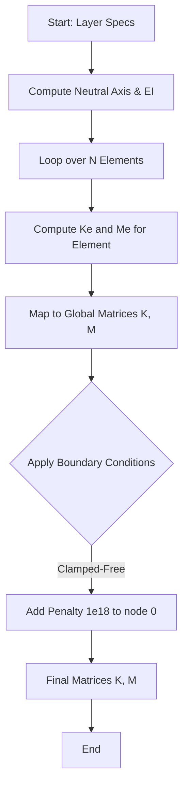
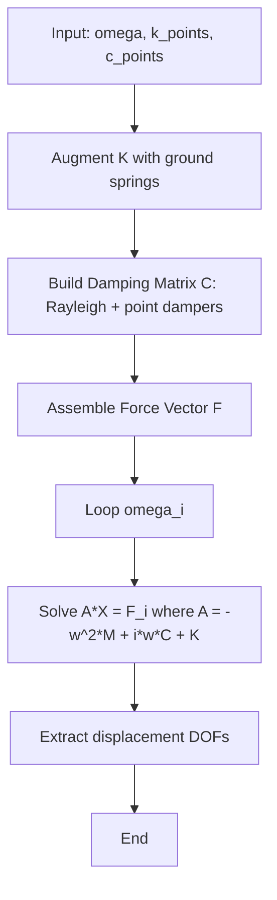

# Continuous Beam: Finite Element Analysis Domain

## Overview
The Continuous Beam module provides a high-fidelity Finite Element Analysis (FEA) environment for simulating Euler-Bernoulli beams with multi-layer composite sections, discrete ground springs, and dampers.

## Mathematical Formulation

### 1. Euler-Bernoulli Beam Theory
The displacement field $w(x,t)$ is governed by the fourth-order partial differential equation:

$$ \frac{\partial^2}{\partial x^2} \left( EI(x) \frac{\partial^2 w}{\partial x^2} \right) + m(x) \frac{\partial^2 w}{\partial t^2} = f(x,t) $$

Where:
- $EI(x)$ is the flexural rigidity.
- $m(x)$ is the mass per unit length.

### 2. Transformed Section Method
For composite multi-layer beams, DeVana uses the Transformed Section Method to calculate equivalent properties. All layers are assumed to have a constant width $b$.

#### Neutral Axis Calculation
The E-weighted neutral axis height $\bar{y}$ is:
$$ \bar{y} = \frac{\sum E_i A_i y_{c,i}}{\sum E_i A_i} $$

#### Equivalent Flexural Rigidity ($EI$)
$$ EI = \sum E_i \left( I_{c,i} + A_i (y_{c,i} - \bar{y})^2 \right) $$

#### Equivalent Mass per Length ($m_{line}$)
$$ m_{line} = \sum \rho_i A_i $$

### 3. Finite Element Discretization (Hermite Elements)
The beam is discretized into $N$ elements. Each node has 2 DOFs: vertical displacement ($w$) and rotation ($\theta$).

#### Element Stiffness Matrix $\mathbf{K}_e$
$$ \mathbf{K}_e = \frac{EI}{L_e^3} \begin{bmatrix}
12 & 6L_e & -12 & 6L_e \\
6L_e & 4L_e^2 & -6L_e & 2L_e^2 \\
-12 & -6L_e & 12 & -6L_e \\
6L_e & 2L_e^2 & -6L_e & 4L_e^2
\end{bmatrix} $$

#### Element Mass Matrix $\mathbf{M}_e$ (Consistent Mass)
$$ \mathbf{M}_e = \frac{m_{line} L_e}{420} \begin{bmatrix}
156 & 22L_e & 54 & -13L_e \\
22L_e & 4L_e^2 & 13L_e & -3L_e^2 \\
54 & 13L_e & 156 & -22L_e \\
-13L_e & -3L_e^2 & -22L_e & 4L_e^2
\end{bmatrix} $$

## Implementation Logic

### Global Assembly and Boundary Conditions
The global matrices are assembled by mapping element DOFs to global indices. Boundary conditions (e.g., Clamped at $x=0$) are enforced using the penalty method.



#### Pseudo-code: Beam Assembly
```python
FUNCTION assemble_beam_fem(N, L, EI, m_line):
    ndof = 2 * (N + 1)
    Le = L / N
    K, M = ZEROS(ndof, ndof)
    
    FOR e IN range(N):
        dofs = [2*e, 2*e+1, 2*(e+1), 2*(e+1)+1]
        Ke = compute_element_K(EI, Le)
        Me = compute_element_M(m_line, Le)
        K[dofs, dofs] += Ke
        M[dofs, dofs] += Me
        
    # Penalty for Clamped end
    K[0, 0] += 1e18
    K[1, 1] += 1e18
    RETURN M, K
```

### Frequency Response Function (`frequency_response`)
Calculates the nodal displacement response to harmonic forcing.



#### Pseudo-code: FRF Calculation
```python
FUNCTION frequency_response(omega, k_pts, c_pts):
    K_aug = K + sum(kval at nearest_node(xloc))
    C = alpha*M + beta*K + sum(cval at nearest_node(xloc))
    
    F = assemble_unit_force_at_tip(ndof)
    
    FOR w IN omega:
        A = -w^2*M + 1j*w*C + K_aug
        displacement_vector = solve(A, F)
        store(displacement_vector[even_indices])
```

## Detailed Method Documentation

### `_compute_section_properties()`
**Purpose:** Calculates composite beam properties using the transformed section method.
**Logic:**
1. Iterates through layers to find the E-weighted centroid (neutral axis).
2. Applies the Parallel Axis Theorem to compute total $EI$.
3. Sums layer densities for $m_{line}$.
**Outputs:** Area ($A$), Flexural Rigidity ($EI$), Mass per line ($m_{line}$).

### `objective_from_targets(...)`
**Purpose:** Evaluates the fitness of a beam configuration for optimization.
**Parameters:**
- `targets`: List of `TargetSpecification` (location, quantity, target value).
- `penalty_weight`: Scalar for inequality violation penalties.
**Logic:**
1. Computes full FRF.
2. Derives requested quantity (displacement, velocity, or acceleration).
3. Extracts magnitudes at target locations.
4. Computes Weighted Mean Squared Error (WMSE).
5. Adds Hinge Penalties for bound violations: $P = \max(0, \text{bound} - \text{mag})$.
**Outputs:** Scalar loss value.

### `derive_quantity(...)`
**Purpose:** Transforms displacement FRF into higher-order derivatives.
**Logic:**
- Displacement: $\mathbf{W}$
- Velocity: $i\omega \mathbf{W}$
- Acceleration: $-\omega^2 \mathbf{W}$
**Outputs:** Complex response matrix of the requested type.

## Rayleigh Damping Model
The global damping matrix $\mathbf{C}$ is constructed as:
$$ \mathbf{C} = \alpha \mathbf{M} + \beta \mathbf{K} + \mathbf{C}_{point} $$
Where:
- $\alpha$: Mass-proportional damping coefficient.
- $\beta$: Stiffness-proportional damping coefficient.
- $\mathbf{C}_{point}$: Contribution from discrete viscous dampers.
