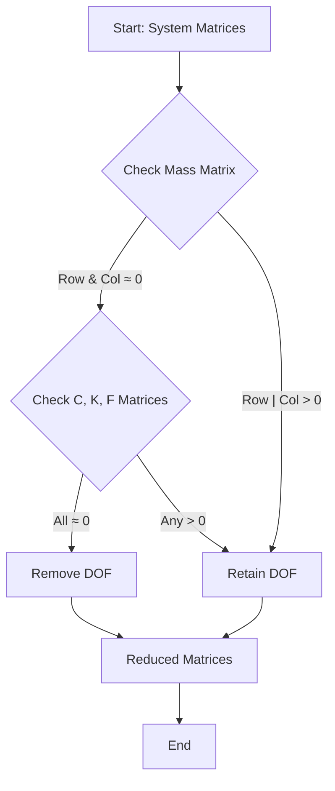
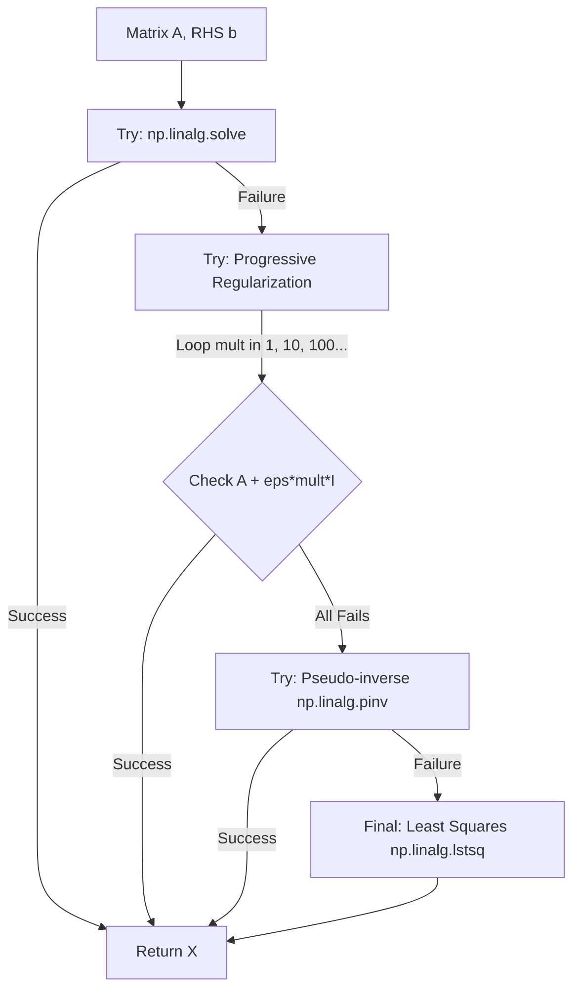

# FRF Engine: Multi-Degree-of-Freedom Vibration Analysis

## Overview
The FRF Engine is the primary computational module for calculating the frequency-dependent response of vibrational systems. It supports complex system architectures with up to 5 degrees of freedom (DOF) by default, including main systems and multiple Dynamic Vibration Absorbers (DVAs).

## Mathematical Formulation

### 1. Governing Equation of Motion
The system is modeled as a linear Multi-Degree-of-Freedom (MDOF) system governed by the matrix differential equation:

$$ \mathbf{M} \ddot{\mathbf{x}}(t) + \mathbf{C} \dot{\mathbf{x}}(t) + \mathbf{K} \mathbf{x}(t) = \mathbf{f}(t) $$

Where:
- $\mathbf{M} \in \mathbb{R}^{n \times n}$ is the Mass Matrix.
- $\mathbf{C} \in \mathbb{R}^{n \times n}$ is the Damping Matrix.
- $\mathbf{K} \in \mathbb{R}^{n \times n}$ is the Stiffness Matrix.
- $\mathbf{x}(t) \in \mathbb{R}^n$ is the displacement vector.
- $\mathbf{f}(t) \in \mathbb{C}^n$ is the complex excitation vector.

### 2. Frequency Response Function (FRF)
Assuming a harmonic excitation $\mathbf{f}(t) = \mathbf{F}(\omega) e^{i\omega t}$ and a steady-state response $\mathbf{x}(t) = \mathbf{X}(\omega) e^{i\omega t}$, the equation transforms to the frequency domain:

$$ \left[ -\omega^2 \mathbf{M} + i\omega \mathbf{C} + \mathbf{K} \right] \mathbf{X}(\omega) = \mathbf{F}(\omega) $$

The complex amplitude vector $\mathbf{X}(\omega)$ is solved as:

$$ \mathbf{X}(\omega) = \mathbf{H}(\omega) \mathbf{F}(\omega) $$

Where the Receptance Matrix $\mathbf{H}(\omega)$ is:

$$ \mathbf{H}(\omega) = \left[ -\omega^2 \mathbf{M} + i\omega \mathbf{C} + \mathbf{K} \right]^{-1} $$

## Implementation Logic

### Selective DOF Elimination (`remove_zero_mass_dofs`)
To ensure numerical stability and prevent Singular Matrix errors, DeVana employs a strict selective DOF elimination strategy. A DOF is removed only if it is completely inactive across all physical matrices.



#### Pseudo-code: Selective DOF Elimination
```python
FUNCTION remove_zero_mass_dofs(M, C, K, F, tol):
    z_mass = ALL(M ≈ 0 along rows AND columns)
    z_damp = ALL(C ≈ 0 along rows AND columns)
    z_stif = ALL(K ≈ 0 along rows AND columns)
    z_force = ALL(F ≈ 0)
    
    # Strict elimination criterion
    dofs_to_remove = z_mass OR (z_damp AND z_stif AND z_force)
    active_dofs = NOT dofs_to_remove
    
    RETURN M[active_dofs, active_dofs], C[active_dofs, active_dofs], 
           K[active_dofs, active_dofs], F[active_dofs], active_dofs
```

### Robust Solver Logic
The FRF calculation uses a multi-stage robust solver to handle ill-conditioned matrices, especially near resonant frequencies.



#### Pseudo-code: Robust Solver
```python
FUNCTION robust_solve(hmat, rhs):
    TRY:
        RETURN solve(hmat, rhs)
    EXCEPT LinAlgError:
        scale = INF_NORM(hmat)
        base_eps = 1e-12 * scale
        FOR mult IN [1, 10, 100, 1000, 10000]:
            TRY:
                RETURN solve(hmat + base_eps * mult * I, rhs)
            EXCEPT LinAlgError: CONTINUE
        TRY:
            RETURN pinv(hmat) @ rhs
        EXCEPT:
            RETURN lstsq(hmat, rhs)
```

## Detailed Method Documentation

### `frf(...)`
**Purpose:** Primary entry point for frequency response analysis.
**Parameters:**
- `main_system_parameters`: Physics constants of the base structure.
- `dva_parameters`: Parameters for the 5-mass DVA topology.
- `omega_start/end/points`: Frequency sweep range.
- `target_values/weights`: Criteria for optimization.
**Logic:**
1. Unpacks parameters into topology indices.
2. Assembles global $\mathbf{M}, \mathbf{C}, \mathbf{K}$ matrices.
3. Performs selective DOF removal.
4. Executes frequency sweep using `robust_solve`.
5. Post-processes data through `process_mass`.
**Outputs:** Dictionary of magnitude vectors, peaks, slopes, and bandwidths for each active mass.

### `process_mass(...)`
**Purpose:** Extracts engineering features from a complex response vector.
**Parameters:**
- `a_mass`: Complex displacement vector across $\omega$.
- `omega`: Frequency vector.
**Logic:**
1. Calculates magnitude: $|A(\omega)|$.
2. Detects significant peaks using prominence filtering.
3. Refines peak resolution using local cubic interpolation.
4. Calculates area under curve via Simpson's rule.
5. Calculates slopes between all identified peaks.
**Outputs:** Structured dictionary of peak positions, values, bandwidths, and slopes.

### `perform_omega_points_sensitivity_analysis(...)`
**Purpose:** Determines the optimal number of frequency points to ensure slope stability.
**Parameters:**
- `convergence_threshold`: Max relative change allowed between iterations.
**Logic:**
1. Iteratively increases `omega_points`.
2. Computes FRF and flattens all metrics.
3. Calculates relative change: $\delta = |M_i - M_{i-1}| / M_{i-1}$.
4. Stops when $\max(\delta) <$ threshold.
**Outputs:** Convergence data and optimal point count.

## Matrix Assembly (5-DOF System)

### Mass Matrix $\mathbf{M}$
The mass matrix is assembled considering the main system inertia and the coupling effects of the DVAs:
$$ M_{ij} = \begin{bmatrix} 
1 + \sum \beta_{1..3} & 0 & -\beta_1 & -\beta_2 & -\beta_3 \\
0 & \mu + \sum \beta_{4..6} & -\beta_4 & -\beta_5 & -\beta_6 \\
... & ... & ... & ... & ...
\end{bmatrix} $$

### Damping Matrix $\mathbf{C}$
Includes both viscous damping and structural damping coefficients:
$$ C_{ij} = 2 \zeta_{dc} \omega_{dc} \times \text{Topology}(\nu_{1..15}) $$

### Stiffness Matrix $\mathbf{K}$
Assembled based on the spring constants $\lambda_{1..15}$:
$$ K_{ij} = \omega_{dc}^2 \times \text{Topology}(\lambda_{1..15}) $$
