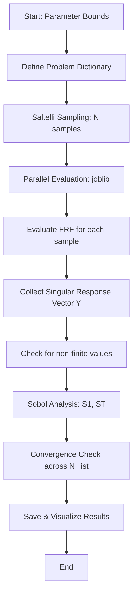

# Sobol Sensitivity Analysis: Global Parameter Influence

## Overview
Sobol Sensitivity Analysis is a variance-based global sensitivity analysis (GSA) method used to quantify the contribution of each input parameter (and their interactions) to the variance of the system's output (singular response).

## Mathematical Formulation

### 1. Variance Decomposition
The total variance $V(Y)$ of the model output $Y = f(\mathbf{X})$ is decomposed into contributions from individual parameters and their interactions:

$$ V(Y) = \sum_i V_i + \sum_{i<j} V_{ij} + \sum_{i<j<k} V_{ijk} + \dots + V_{12..k} $$

Where:
- $V_i = V[E(Y|X_i)]$ is the variance contribution of parameter $X_i$.
- $V_{ij} = V[E(Y|X_i, X_j)] - V_i - V_j$ is the variance contribution of the interaction between $X_i$ and $X_j$.

### 2. Sensitivity Indices

#### First-order Sensitivity Index ($S_1$)
Measures the main effect of parameter $X_i$ on the output variance:
$$ S_i = \frac{V_i}{V(Y)} $$

#### Total-order Sensitivity Index ($S_T$)
Measures the total contribution of $X_i$, including its main effect and all higher-order interactions with other parameters:
$$ S_{Ti} = \frac{E_{X_{\sim i}}[V_{X_i}(Y|X_{\sim i})]}{V(Y)} = 1 - \frac{V_{X_{\sim i}}[E_{X_i}(Y|X_{\sim i})]}{V(Y)} $$

## Implementation Logic

### Sampling and Evaluation Pipeline
DeVana utilizes the `SALib` library for sampling and analysis, coupled with `joblib` for parallel model evaluations.



#### Pseudo-code: Sobol Analysis
```python
FUNCTION perform_sobol_analysis(params_bounds, N_list):
    problem = {'num_vars': len(params), 'names': names, 'bounds': bounds}
    
    FOR N IN N_list:
        # Saltelli generates N*(2k+2) samples
        param_values = saltelli_sample(problem, N)
        
        # Parallel execution across CPU cores
        Y = PARALLEL_EXECUTE(evaluate_frf, param_values)
        
        # Sensitivity indices calculation
        Si = sobol_analyze(problem, Y)
        
        store_results(Si['S1'], Si['ST'], N)
```

## Detailed Method Documentation

### `perform_sobol_analysis(...)`
**Purpose:** Orchestrates the entire GSA workflow across multiple sample sizes.
**Parameters:**
- `dva_parameters_bounds`: Dictionary or list of (low, high) ranges for design variables.
- `num_samples_list`: List of base sample sizes (e.g., [10, 100, 1000]) to check convergence.
- `n_jobs`: Number of parallel workers.
**Logic:**
1. Separates fixed parameters from variable parameters.
2. Constructs the SALib problem definition.
3. Iterates through sample sizes to generate Saltelli matrices.
4. Uses `Parallel` and `delayed` to evaluate the FRF model for each sample.
5. Replaces `NaN` or `inf` results with $0.0$ to maintain statistical integrity.
6. Computes $S_1$ and $S_T$ indices.
**Outputs:** Dictionary of sensitivity indices and sample size history.

### `evaluate_frf(...)`
**Purpose:** Worker function for a single parameter set.
**Logic:**
1. Merges sampled variable values with fixed parameters.
2. Orders parameters according to the DVA topology.
3. Executes the full `frf(...)` solver.
4. Extracts the `singular_response` metric.
**Outputs:** Scalar response value.

### `save_sorted_sensitivity(...)`
**Purpose:** Ranks parameters by their influence.
**Logic:**
1. Extracts indices from the last (largest) run.
2. Sorts parameters in descending order of $S_1$ and $S_T$.
3. Saves to CSV for direct engineering decision support (e.g., identifying which DVAs to prioritize for tuning).

## Statistical Reliability
To ensure the sensitivity results are not artifacts of insufficient sampling, DeVana provides:
1. **Convergence Plots:** Tracking $S_1$ and $S_T$ as a function of sample size.
2. **Error Estimation:** Calculation of variance, standard deviation, and Confidence Intervals (CI) for the indices.

$$ \text{CI}_{95\%} = \text{mean}(S) \pm 1.96 \frac{\sigma}{\sqrt{N}} $$
