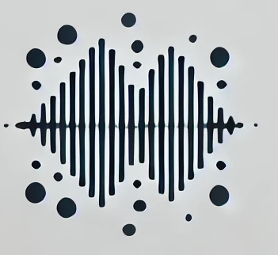
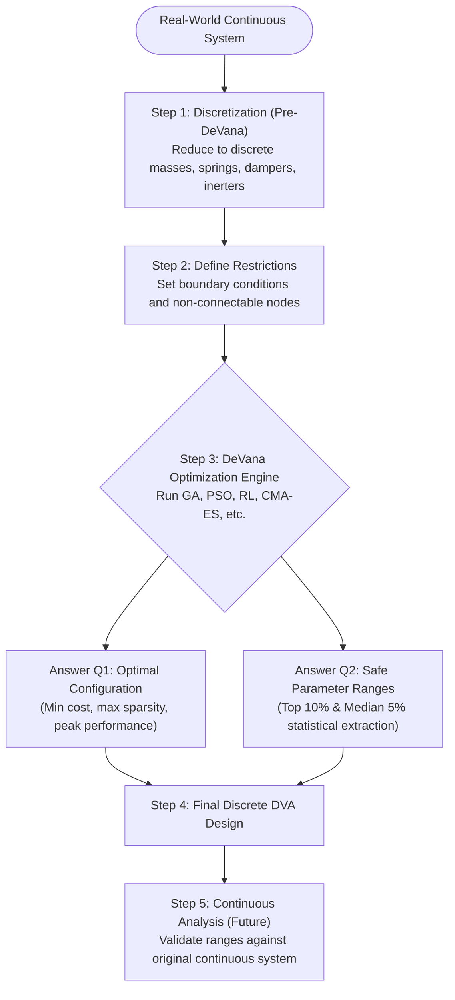

# DeVana: Dynamic Vibration Absorber Optimization Framework

<div align="center">
  
  <br />
  <p align="center">
    <b>An advanced, production-ready engineering framework bridging the gap between theoretical vibration analysis and algorithmic, multi-objective Dynamic Vibration Absorber (DVA) design.</b>
  </p>

  [](https://github.com/mahan2079/DeVana)
  [](LICENSE)
  [](https://www.python.org/)
  []()
</div>

---

## 🛑 The Engineering Challenge & Research Gap

In real-world mechanical systems—from precision rotary devices and robotic arms to aerospace components and large civil infrastructure—**continuous structures** pose immense vibration control challenges. For simple uniform geometries, elegant mathematical models apply. But for complex real-world systems, engineers must rely heavily on numerical techniques like Finite Element Analysis (FEM) or mesh-free discretization.

Historically, designing Dynamic Vibration Absorbers (DVAs)—systems of masses, springs, dampers, and inerters—has relied entirely on **engineering intuition, heuristic knowledge bases, and manual trial-and-error**. There has been a crucial lack of open-source, algorithmic software capable of systematically managing:
1. The vast, high-dimensional design space of DVA parameters.
2. Competing multi-criteria objectives (e.g., minimizing cost, weight, complexity, and vibration simultaneously).
3. The transition from discovering theoretical "perfect points" to extracting **manufacturable, robust parameter tolerance ranges**.

---

## 💡 The DeVana Solution

**DeVana** was born out of comprehensive academic research to shift DVA design from an experience-based art to a rigorous, algorithmic science. 

The software operates by taking a discrete vibrational model (masses, springs, dampers, and inerters) derived from the original continuous system. By defining physical restrictions (e.g., specifying which masses or bases cannot be physically connected), DeVana creates a comprehensive, fully-coupled mathematical space. It then leverages advanced machine learning and metaheuristics to answer two fundamental engineering questions:

1. **The Optimal Topology (Q1):** What is the absolute best combination of DVA components based on user-defined criteria? DeVana systematically finds configurations that minimize the number of active parameters, minimize total manufacturing/maintenance cost, and maximize energy dissipation.
2. **The Safe Ranges (Q2):** Real-world manufacturing cannot produce infinite-precision continuous values (e.g., a spring stiffness of exactly 145.32 N/m). Given the infinite combinations of parameters, what are the **safe, reliable ranges** for each DVA parameter? DeVana performs deep statistical extraction so that *any* combination chosen within these ranges will satisfy the performance thresholds.

### The Algorithmic Paradigm



---

## 💎 Core Pillars

### 1. Advanced Optimization Suite
DeVana features a diverse library of optimization workers, each optimized for high-dimensional mechanical design spaces:
*   **Genetic Algorithms (GA)**: Adaptive crossover/mutation rates with ML-based parameter control.
*   **Particle Swarm (PSO)**: Multi-topology support with velocity clamping.
*   **Evolution Strategies (CMA-ES)**: State-of-the-art covariance matrix adaptation for non-convex landscapes.
*   **Multi-Objective (NSGA-II)**: Pareto-optimal front generation balancing vibration, sparsity, and cost.
*   **Reinforcement Learning (RL)**: Continuous policy-gradient agents for intelligent parameter tuning.
*   **Simulated Annealing (SA) & Differential Evolution (DE)**: Robust global search techniques.

### 2. Intelligent Seeding Engine
Accelerate convergence by bypassing random initialization with DeVana's proprietary seeding strategies:
*   **Neural Seeder**: Online learning via MLP ensembles to predict fitness landscapes using UCB and EI acquisition.
*   **Memory Seeder**: Cross-session persistence that learns from successful historical designs.
*   **Quasi-Random**: Sobol sequences and Latin Hypercube Sampling (LHS) for uniform space coverage.

### 3. High-Fidelity Analysis
*   **FRF Computation**: Robust Frequency Response Function solver with automatic DOF pruning and pseudo-inverse fallbacks for singular matrices.
*   **Sobol Sensitivity**: Global variance-based sensitivity analysis to identify critical design parameters.
*   **Peak & Slope Analysis**: Automated modal identification with high-precision topological prominence filtering.

---

## 🚀 Future Roadmap: Continuous System Integration

Currently, DeVana flawlessly handles highly complex discrete systems (e.g., the fully-coupled 2DOF-3DOF benchmark featured in our documentation). 

The **next major frontier** for DeVana is the seamless integration of **Continuous Analysis**. In the future, once DeVana extracts the "Safe Ranges" for the discrete DVA components, the software will automatically feed these ranges back into integrated FEM/continuous modules (such as the under-construction Continuous Beam module). This will provide an end-to-end pipeline: from real-world continuous structures, to discrete optimization, and straight back to continuous validation.

---

## 🛠 Project Structure

```text
DeVana/
├── codes/
│   ├── gui/                # Modular Mixin-based UI architecture
│   ├── workers/            # Multi-threaded optimization algorithms
│   ├── modules/            # Core physics and sensitivity engines
│   └── RL/                 # Reinforcement Learning agents
├── Documents/              # Comprehensive technical documentation & flowcharts
├── Icon/                   # Application assets
└── requirements.txt        # Environment dependencies
```

---

## 🏁 Getting Started

### Prerequisites
- Python 3.8 or higher
- Git

### Installation

1. **Clone the Repository**
   ```bash
   git clone https://github.com/mahan2079/DeVana.git
   cd DeVana
   ```

2. **Set Up Environment**
   ```bash
   python -m venv venv
   source venv/bin/activate  # Windows: venv\Scripts\activate
   ```

3. **Install Dependencies**
   ```bash
   pip install -r requirements.txt
   ```

4. **Run the Application**
   ```bash
   python codes/run.py
   ```

### 🐳 Docker Deployment (Production API & Testing)
For production-ready headless execution or automated testing, DeVana is fully containerized.

1. **Run the FastAPI Backend**
   ```bash
   docker-compose up devana-api -d
   ```
   The API will be available at `http://localhost:8000/api/docs`.

2. **Run the Test Suite in Docker**
   ```bash
   docker-compose run test
   ```
   Executes the entire comprehensive suite of 25+ integration and unit tests in a clean container.

3. **Run the GUI inside Docker (Cross-Platform)**
   The GUI can also be spun up natively in Docker. Ensure you have an X11 server running on your host machine (e.g., XQuartz on macOS, VcXsrv on Windows, or native X11 on Linux) and have allowed connections (`xhost +`).
   ```bash
   # Export your DISPLAY variable if not already set (e.g. export DISPLAY=:0 on Linux)
   docker-compose up devana-gui
   ```

---

## 📚 Documentation

For deep technical dives, algorithm flowcharts, mathematical models, and API references, please explore our comprehensive **[Documentation Index](Documents/INDEX.md)**.

---

## 🤝 Contributing

Contributions are what make the engineering community such an amazing place to learn, inspire, and create. Any contributions you make are **greatly appreciated**.

1. Fork the Project
2. Create your Feature Branch (`git checkout -b feature/AmazingFeature`)
3. Commit your Changes (`git commit -m 'Add some AmazingFeature'`)
4. Push to the Branch (`git push origin feature/AmazingFeature`)
5. Open a Pull Request

---

## ✉️ Contact

**Mahan Dashti Gohari**  
Lead Developer & Researcher  
📧 [mahan.dashti.gohari@gmail.com](mailto:mahan.dashti.gohari@gmail.com)  
🔗 [GitHub Profile](https://github.com/mahan2079)

---

## 📜 License

Distributed under the **Apache License 2.0**. See `LICENSE` for more information.

---
<p align="center">
  Built with ❤️ for the Structural Dynamics Community
</p>